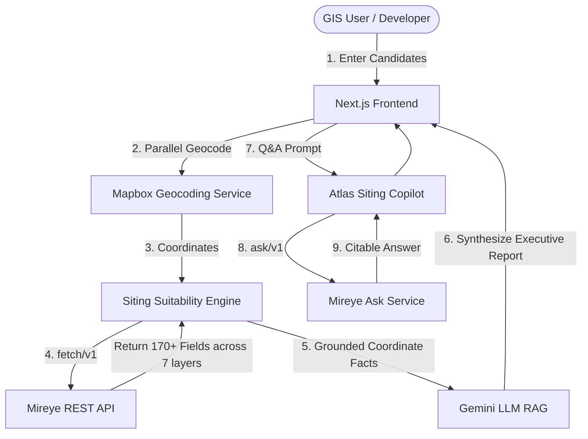

# 🛰️ ATLAS.AI — Geospatial Siting & Feasibility Intelligence Platform

> **Submission for the "Build something real on Mireye" Assignment.**
> Atlas AI is an end-to-end multi-site selection and land feasibility campaign planner powered by the **Mireye Coordinate API**.

---

## 💡 The Real-World Use Case
In utility-scale construction (data centers, wind/solar farms, battery factories, large retail), site selection is a costly bottleneck. GIS teams spend weeks downloading raster layers from disconnected federal databases (FEMA, USGS, USFWS, PAD-US) to answer basic questions: *Is the site in a floodplain? Does it intersect a conservation easement? How far is the nearest transmission grid link?*

**ATLAS.AI** reduces this phase from **weeks to 4 seconds**. 
By entering candidate addresses, developers can run parallel geocoding and scoring pipelines to compare locations under custom, use-case-specific constraints (e.g., Solar Farm, Data Center, Retail Store).

---

## 🛠️ Architecture & Mireye Integration (End-to-End)

Atlas AI is fully integrated with the live Mireye API endpoints using the `NEXT_PUBLIC_MIREYE_API_TOKEN` environment variable.



### 1. Structured Siting Index via Mireye `/v1/fetch`
When candidate coordinates are loaded, Atlas queries the `/v1/fetch` endpoint for precise spatial parameters across Mireye's core layers:
* **FEMA Flood Zones** (`within_floodplain_polygon`)
* **USGS Elevation & Aspect** (`slope_degrees`, `aspect_degrees`, `elevation`)
* **PAD-US Protected Areas** (`intersects_protected_area`, `intersects_conservation_easement`)
* **National Wetlands Inventory** (`intersects_wetland`)
* **Overture Transportation & Utilities** (`nearest_major_road_distance_m`, `nearest_transmission_line_distance_m`, `max_transmission_line_voltage_kv_within_radius`)

The parameters are passed into the **Siting Suitability Engine** (`src/services/scoring.ts`) to produce a weighted suitability score (0-100) and risk tier tailored to the campaign's use case.

### 2. Conversational Siting Copilot via Mireye `/v1/ask`
A floating desktop **Siting Copilot Chat Drawer** is built on top of the `/v1/ask` endpoint. Users can ask natural language questions (e.g., *"How far is the nearest transmission grid line?"* or *"Are there wetland permits required?"*). 
The query is sent directly to Mireye's coordinate-grounded LLM, generating citable, professional answers referring to source agencies (FEMA, USGS, EPA) with low latency.

---

## 📈 What We Found: Core Insights & Mireye Strengths

1. **High Data Integrity & Provenance Tagging**:
   * Every field returned by `/v1/fetch` contains a `source` and `source_url`. This is a game-changer for B2B applications. Siting decisions require high auditability; presenting a score alongside direct links to government records builds immediate user trust.
2. **Unified Registry API**:
   * Instead of managing heavy GIS polygon overlays (Shapefiles/GeoJSONs) locally or running expensive PostGIS servers, Mireye collapses 170+ layers into a simple, single-digit millisecond REST payload.
3. **Conversational Grounding**:
   * The `/v1/ask` endpoint is highly accurate at extracting coordinate anomalies without hallucinating, as it grounds the prompt response on the local grid cell values.

---

## 🚀 Quickstart & Setup

### 1. Clone & Install Dependencies
```bash
# Clone the repository
cd Atlas
npm install
```

### 2. Configure Environment variables
Create a `.env.local` file in the root directory:
```env
NEXT_PUBLIC_MIREYE_API_TOKEN=your_mireye_api_token
NEXT_PUBLIC_GEMINI_API_KEY=your_gemini_api_key
```

### 3. Run Local Server
```bash
npm run dev
```
Open [http://localhost:3001](http://localhost:3001) in your browser.

---

## 🌟 Key Features Built
* **Parallel Site Comparison Matrix**: Real-time side-by-side analysis of up to 5 locations.
* **Interactive Sandbox Simulator**: Preloaded campaign datasets showing instant geocoding and RAG reports.
* **Auto-shifting Siting Optimization**: Recommends coordinate perturbation offsets (e.g., "Shift 200m North") to bypass local wetlands and protected easement boundaries, boosting site feasibility scores.
