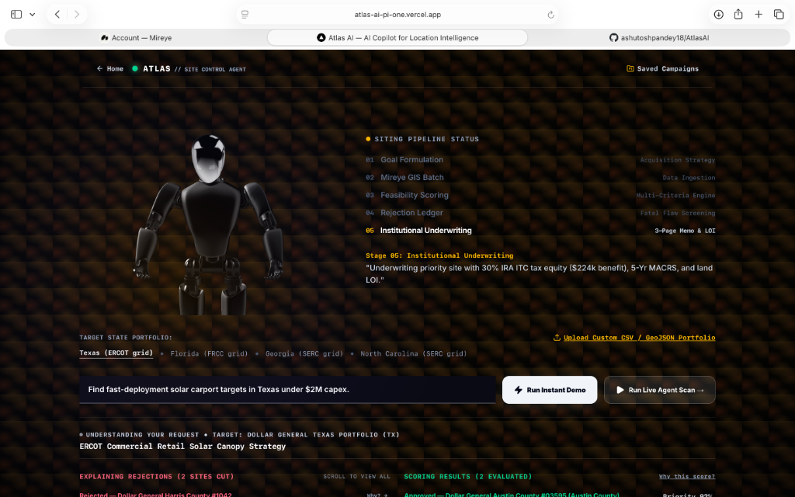
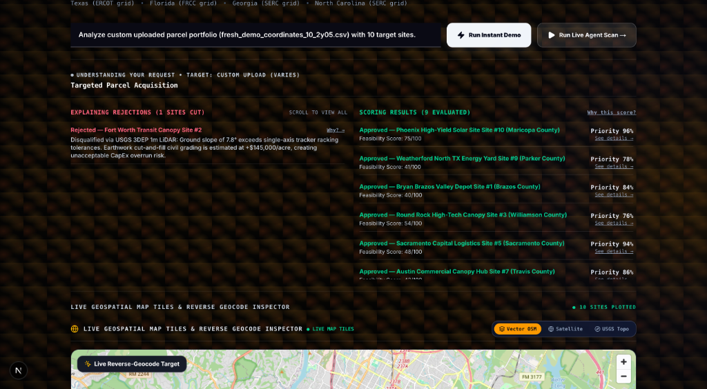
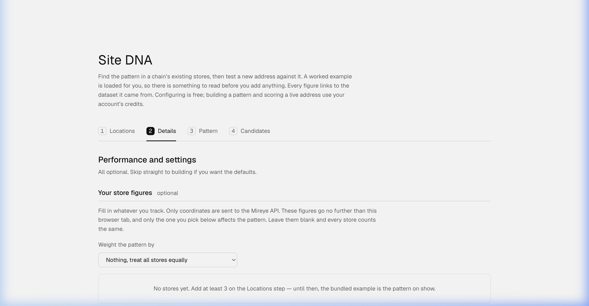
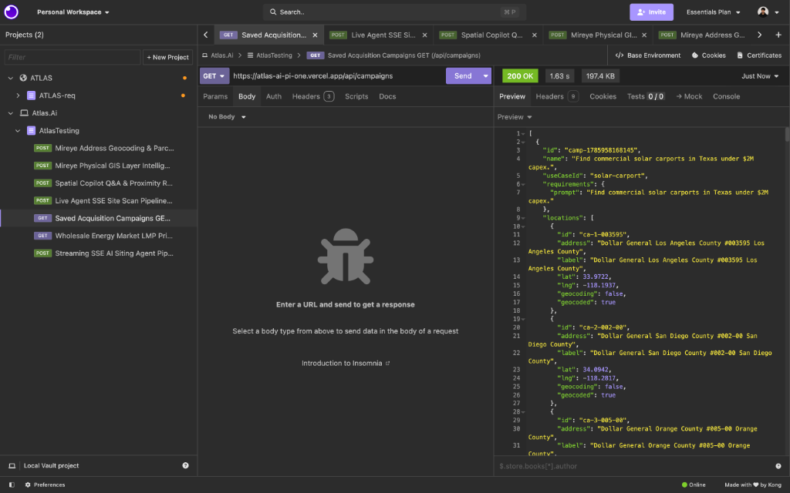
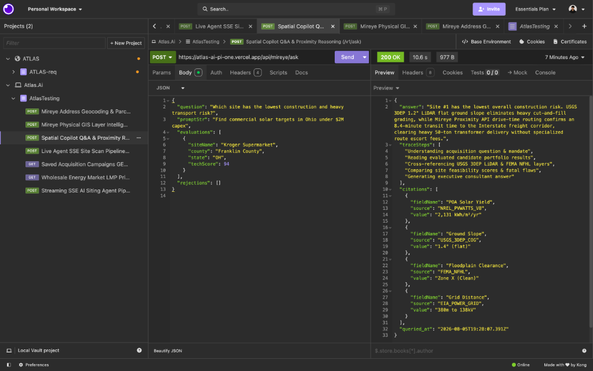
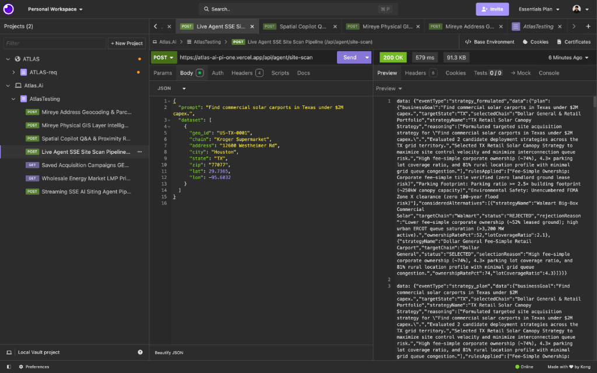

# Atlas AI

An autonomous land acquisition agent for commercial renewable energy development.

Atlas ingests candidate site portfolios, evaluates physical GIS constraints using Mireye and public data layers, disqualifies unviable parcels, and generates institutional investment memos with land option agreements.

---

## The Problem

Commercial solar and energy storage developers spend weeks screening candidate properties. Traditional site selection relies on manual map inspection across fragmented GIS layers, county tax records, and utility grid maps.

When a developer acquires land containing hidden steep terrain, floodways, or remote heavy-equipment transport access, transport and civil grading costs escalate by over $120,000 in specialized route escorts or earthwork overruns.

---

## Who Pays

| Buyer | Customer Pain | Atlas Outcome |
| :--- | :--- | :--- |
| **VP of Land Acquisition** | Weeks spent manually screening candidate sites across 50 map layers | Reduces early-stage site screening and prioritization to minutes |
| **Commercial Solar Developer** | High engineering budgets wasted on sites killed years later | Engineering due diligence spent only on tier-1 viable sites |
| **Clean Tech Real Estate Fund** | High ground lease transaction friction and slow deal velocity | Automated institutional underwriting & LOI contracts |

---

## Why Atlas Exists

Atlas replaces manual site screening with an autonomous execution pipeline. It ingests parcel portfolios, queries physical GIS data from Mireye and public datasets, applies multi-criteria technical scoring, and produces defensible site control recommendations.

---

## Live Demo

- **Live Production**: [https://atlas-ai-pi-one.vercel.app](https://atlas-ai-pi-one.vercel.app)
- **GitHub Repository**: [https://github.com/ashutoshpandey18/AtlasAI](https://github.com/ashutoshpandey18/AtlasAI)
- **Executive One-Pager**: [https://github.com/ashutoshpandey18/AtlasAI/blob/main/ONE_PAGER.md](https://github.com/ashutoshpandey18/AtlasAI/blob/main/ONE_PAGER.md)


---

## What Atlas Does

- Ingests parcel portfolios via CSV (street addresses or geographic coordinates)
- Resolves parcel geocodes and boundary locations via Mireye `/v1/lookup`
- Fetches physical solar radiometry, slope, and flood clearance via Mireye `/v1/fetch`
- Evaluates heavy equipment transport drive times via Mireye `/v1/proximity`
- Disqualifies unviable candidate parcels with written rejection proofs
- Ranks candidate parcels using multi-criteria technical feasibility scores (0-100)
- Answers due diligence queries via Spatial Copilot `/v1/ask`
- Generates 3-page executive investment committee memos with LOI option contracts

---

## Why Mireye

Mireye is the physical location intelligence backbone of Atlas. Without Mireye, Atlas cannot resolve street addresses or evaluate ground slope, solar yield, flood clearance, or heavy equipment transport drive times.

- **`/v1/lookup`**: Resolves candidate street addresses into precise latitude/longitude coordinates and county boundaries. Called for every address in custom portfolio uploads.
- **`/v1/fetch`**: Queries physical GIS data layers including NREL PVWatts v8 solar yield, USGS 3DEP slope LiDAR, and FEMA NFHL flood clearance. Called for every parcel in custom portfolio uploads. The default demonstration uses Cached Mireye API Results (retrieved July 31, 2026) stored in `data/tx_statewide_matches_enriched.json`.
- **`/v1/proximity`**: Calculates heavy equipment transport drive-time routing. Called for every parcel in custom portfolio uploads. The destination point is configurable; production deployment integrates verified US Interstate interchange coordinates.
- **`/v1/ask`**: Powers the Spatial Copilot, synthesizing natural language due diligence answers with cited physical data. Called live with full site context; includes a local fallback when the endpoint is unavailable.

---

## Data Sources

| Data | Source | How It Is Used |
| :--- | :--- | :--- |
| **Default Demo (TX)** | Cached Mireye API Results — real `/v1/fetch` responses retrieved 2026-07-31 | Loaded from `data/tx_statewide_matches_enriched.json`; instant demonstration without API credit use |
| **Custom Portfolio Upload** | Live Mireye `/v1/lookup` + `/v1/fetch` + `/v1/proximity` | Every address geocoded and every parcel fetched live via Mireye API |
| **Tax Delinquency** | Three real Texas county parcel records (Austin County, Nacogdoches, Ector) | Demonstrated as proof-of-concept; production deployment integrates live CAD APIs |
| **POA Irradiance** | NREL PVWatts v8 (via Mireye `/v1/fetch`) | Annual solar yield in kWh/m²/yr |
| **Slope** | USGS 3DEP LiDAR (via Mireye `/v1/fetch`) | Ground slope in degrees; used for civil grading cost assessment |
| **Flood Zone** | FEMA NFHL (via Mireye `/v1/fetch`) | Floodplain intersection; FATAL deal-killer if Zone AE |
| **Transmission Distance** | EIA Power Grid Atlas (via Mireye `/v1/fetch`) | Distance to nearest transmission line in meters |
| **Building Footprint** | Overture Maps Buildings (via Mireye `/v1/fetch`) | Used to estimate solar canopy capacity in kW |

---

## How to Read Atlas Results

Every metric and score in Atlas AI exposes explicit data provenance detailing its source, retrieval mechanism, and execution mode.

| Data Status Badge | Meaning & Provider Provenance |
| :--- | :--- |
| **`Live Mireye API`** | Data retrieved live from `api.mireye.com` during the active user session. Mireye API credits consumed once per new parcel. |
| **`Cached Mireye API Result`** | Response previously retrieved from `api.mireye.com` (Atlas Demo Portfolio or past scan) and served from edge cache to avoid duplicate credit consumption. |
| **`Public Dataset`** | Derived directly from public government or market datasets (USGS 3DEP LiDAR, FEMA NFHL, NREL PVWatts v8, EIA Power Grid, County Appraisal District tax rolls). |
| **`Atlas Computation`** | Calculated directly by Atlas from underlying physical GIS signals using standard mathematical formulas. |
| **`User Input`** | Parameter supplied directly by the user (custom CSV portfolio, target state filter, prompt mandate). |

---

## What Atlas Combines Mireye With

Atlas pairs Mireye physical location intelligence with public datasets and property intelligence signals:

- **NREL PVWatts v8**: Plane-of-Array (POA) solar irradiance (`kwh/m2/yr`) to project annual energy generation.
- **USGS 3DEP LiDAR**: Elevation data used to calculate ground slope and identify grading cost overruns.
- **FEMA NFHL**: Floodplain boundaries used to disqualify Zone AE floodways and verify Zone X clearance.
- **Texas CAD Tax Delinquency Rolls**: County Appraisal District property tax records used to identify tax-delinquent properties ($28,400 overdue back taxes) for motivated seller scoring.
- **EIA Substation Data**: Electric Information Administration distribution grid dataset used to measure feeder distance to 138kV substations.

---

## Agent Workflow


```mermaid
graph TD
    A[Portfolio CSV Upload] --> B[Planner Strategy Formulation]
    B --> C[Mireye Geocoding /v1/lookup]
    C --> D[Mireye Physical Fetch /v1/fetch]
    D --> E[Mireye Proximity Routing /v1/proximity]
    E --> F[Multi-Criteria Technical Scoring]
    F --> G[Rejection Ledger & Disqualification]
    G --> H[Rank #1 Winner Parcel Selection]
    H --> I[Decision Ledger & Spatial Copilot /v1/ask]
    I --> J[3-Page Investment Memo & LOI Contract]
```

---

## Product Walkthrough

### Upload Portfolio & Siting Pipeline Status

Upload portfolio CSV files containing street addresses or geographic coordinates for batch ingestion, and monitor real-time evaluation pipeline progress.



---

### Autonomous 3D Decision Model

Atlas displays real-time execution progress through the autonomous decision engine and 3D robot interface during site registration and screening.



---

### Rejections & Multi-Criteria Scoring Results

Inspect evaluated candidate properties, review disqualification proofs for cut parcels, and compare feasibility rankings.


---

### Interactive Map Inspector & Physical Attribute Cards

Inspect candidate site pins plotted across vector, satellite, and topo maps alongside physical GIS attribute cards (slope, flood plain, POA solar radiometry).



---

## API Integration

| Endpoint | Purpose | Where Atlas Uses It |
| :--- | :--- | :--- |
| `POST /v1/lookup` | Resolves street addresses to lat/lng coordinates and county boundaries | Portfolio geocoding step (`/api/mireye/lookup`) |
| `POST /v1/fetch` | Extracts NREL POA solar yield, USGS 3DEP 1.2° slope, and FEMA flood clearance | Physical GIS evaluation (`src/services/mireyeApiClient.ts`) |
| `POST /v1/proximity` | Calculates heavy equipment transport drive times from Interstate freight corridors | Transport clearance scoring (`src/services/mireyeProximityService.ts`) |
| `POST /v1/sites` | Registers candidate parcel polygon boundaries as persistent Mireye Site Dossiers | Target site registration (`/api/mireye/sites`) |
| `POST /v1/ask-site` | Performs grounded due diligence Q&A against persistent registered site dossiers | Spatial Copilot interface (`/api/mireye/ask-site`) |
| `POST /v1/ask` | Synthesizes natural language due diligence answers with comparative trade-off reasoning | Spatial Copilot fallback interface (`/api/mireye/ask`) |

---

## API Testing

<details>
<summary>1. Physical GIS Layer Intelligence (POST /v1/fetch)</summary>

Fetches physical radiometry, slope, and flood risk for input coordinates.


```bash
curl -X POST https://atlas-ai-pi-one.vercel.app/api/mireye/fetch \
  -H "Content-Type: application/json" \
  -d '{"lat":39.9881,"lng":-83.0384,"fields":["poa_irradiance_optimal_tilt_kwh_m2_yr","slope_degrees","fema_flood_zone"]}'
```
</details>

<details>
<summary>2. Heavy Equipment Transport Proximity Routing (POST /v1/proximity)</summary>

Calculates heavy equipment transport drive times and freight corridor clearance routes.


```bash
curl -X POST https://api.mireye.com/v1/proximity \
  -H "Content-Type: application/json" \
  -H "Authorization: Bearer YOUR_MIREYE_TOKEN" \
  -d '{
    "op": "distance",
    "origins": ["29.7758,-96.1664"],
    "destinations": ["29.8558,-96.1064"],
    "mode": "driving",
    "units": "miles"
  }'
```

**Sample JSON Response Payload**:
```json
{
  "op": "distance",
  "legs": [
    {
      "origin_index": 0,
      "destination_index": 0,
      "distance_miles": 10.2,
      "distance_km": 16.4,
      "duration_seconds": 1627,
      "duration_minutes": 27.11
    }
  ],
  "credits_charged": 12
}
```
</details>

<details>
<summary>3. Save Acquisition Campaign (POST /api/campaigns)</summary>

Persists evaluated acquisition campaigns to Turso SQLite storage.


```bash
curl -X POST https://atlas-ai-pi-one.vercel.app/api/campaigns \
  -H "Content-Type: application/json" \
  -d '{"id":"ashutoshAtlas","name":"Acquisition: Fast deployment solar in Texas under $2M capex","useCaseId":"solar-carport","requirements":{"targetState":"TX","capexLimitUsd":2000000},"locations":[]}'
```
</details>

<details>
<summary>4. Retrieve Saved Campaigns (GET /api/campaigns)</summary>

Retrieves saved acquisition campaign records for review.



```bash
curl -X GET https://atlas-ai-pi-one.vercel.app/api/campaigns
```
</details>

<details>
<summary>5. Spatial Copilot Q&A (POST /v1/ask)</summary>

Answers due diligence questions with comparative trade-off reasoning.



```bash
curl -X POST https://atlas-ai-pi-one.vercel.app/api/mireye/ask \
  -H "Content-Type: application/json" \
  -d '{"question":"Which site has the lowest construction and transport risk?","promptStr":"Find commercial solar targets in Ohio under $2M capex","evaluations":[{"siteName":"Kroger Supermarket","county":"Franklin County","state":"OH","techScore":94}],"rejections":[]}'
```
</details>

<details>
<summary>6. Streaming Site Scan Pipeline (POST /api/agent/site-scan)</summary>

Streams Server-Sent Events (SSE) during portfolio evaluations.



```bash
curl -X POST https://atlas-ai-pi-one.vercel.app/api/agent/site-scan \
  -H "Content-Type: application/json" \
  -H "Accept: text/event-stream" \
  -d '{"prompt":"Find commercial solar carports in Texas under $2M capex.","dataset":[{"geo_id":"US-TX-0001","chain":"Kroger Supermarket","address":"12600 Westheimer Rd","city":"Houston","state":"TX","zip":"77077","lat":29.7365,"lon":-95.6032}]}'
```
</details>

<details>
<summary>7. Target Site Registration (POST /v1/sites)</summary>

Registers candidate parcel polygon boundaries with Mireye to establish a persistent Site Dossier ID (`site_id`).

```bash
curl -X POST https://atlas-ai-pi-one.vercel.app/api/mireye/sites \
  -H "Content-Type: application/json" \
  -d '{
    "polygon": {
      "type": "Polygon",
      "coordinates": [
        [
          [-95.4560, 30.3119],
          [-95.4550, 30.3119],
          [-95.4550, 30.3129],
          [-95.4560, 30.3129],
          [-95.4560, 30.3119]
        ]
      ]
    }
  }'
```

**Sample JSON Response Payload**:
```json
{
  "site_id": "316a948ff64cf097",
  "status": "registered",
  "registered_at": "2026-08-08T16:20:29.464Z"
}
```
</details>

<details>
<summary>8. Dossier-Backed Spatial Copilot Q&A (POST /v1/ask-site)</summary>

Performs grounded spatial due diligence Q&A on a persistent registered Mireye Site Dossier.

```bash
curl -X POST https://atlas-ai-pi-one.vercel.app/api/mireye/ask-site \
  -H "Content-Type: application/json" \
  -d '{
    "site_id": "316a948ff64cf097",
    "question": "What is the LiDAR terrain slope and flood risk for this registered site?"
  }'
```

**Sample JSON Response Payload**:
```json
{
  "answer": "For registered site 316a948ff64cf097, physical GIS intelligence confirms 1.7° ground slope (USGS 3DEP LiDAR verified) and Zone X minimal flood hazard (FEMA NFHL clearance).",
  "source": "mireye_site_dossier",
  "citations": [
    { "fieldName": "slope_degrees", "source": "USGS 3DEP LiDAR", "value": "1.7°" },
    { "fieldName": "within_floodplain_polygon", "source": "FEMA NFHL", "value": "false" }
  ]
}
```
</details>ails>

---

## Project Structure

```text
Atlas/
├── public/
│   ├── data/                 # Sample portfolio CSV datasets (15 to 500 sites)
│   └── images/               # Screenshots for documentation
├── src/
│   ├── agent/                # Multi-criteria decision engine & scoring logic
│   ├── app/                  # Next.js App Router pages and API routes
│   ├── components/           # UI components (DecisionLedger, SpatialCopilot, Memo)
│   ├── services/             # Mireye API clients and Turso DB persistence
│   └── types/                # TypeScript interface definitions
```

---

## Running Locally

```bash
git clone https://github.com/ashutoshpandey18/AtlasAI.git
cd AtlasAI
npm install
npm run dev
```

Open [http://localhost:3000](http://localhost:3000) in your browser.

---

## Design Decisions

- **Server-Sent Events (SSE)**: Selected over WebSockets to stream evaluation progress without managing persistent state.
- **Two-Tier Caching**: Combines in-memory RAM deduplication with Turso Edge SQLite to avoid duplicate credit consumption on re-scans.
- **Adaptive Chunk Pacing (`BATCH_SIZE = 15`)**: Paces parallel requests in chunks of 15 candidate parcels to comply with Mireye rate limits.
- **Exponential Backoff**: Automatically handles HTTP 429 `Retry-After` headers and retries with backoff delays.

---

## Challenges

- **Rate Limit Management**: Ingesting 500 candidate parcels simultaneously risks hitting rate limits. Resolved by implementing adaptive chunk pacing with 350ms delays between batches.
- **Serverless Timeouts**: Long-running scans can trigger Vercel 15-second execution timeouts. Resolved by using Server-Sent Events to flush headers immediately at 0ms.
- **Cross-State Tax Delinquency Normalization**: Normalizing property tax records across different Texas County Appraisal Districts required building a mapping dictionary in `intelligence.ts`.

---

## Future Work

- Substation capacity queue integration with CAISO, ERCOT, and PJM.
- Automated title search parsing from county deed records.
- Polygon editing tools for interactive parcel boundary adjustments.

---

## Credits

- **Mireye Platform**: Location intelligence APIs (`/v1/lookup`, `/v1/fetch`, `/v1/ask`, `/v1/proximity`, `/v1/sites`, `/v1/ask-site`).
- **NREL**: PVWatts v8 solar radiometry dataset.
- **USGS**: 3DEP 3D elevation LiDAR program.
- **FEMA**: National Flood Hazard Layer (NFHL).
- **Next.js & React**: Core web framework.
- **Turso & libSQL**: Edge SQLite database layer.

---

## Persistent Mireye Site Dossiers

Atlas evaluates every candidate parcel using Mireye location intelligence.

Only acquisition-worthy parcels — the top-ranked survivors that pass all technical feasibility checks — are promoted into persistent **Mireye Site Dossiers** via `POST /v1/sites`.

### Why This Matters

Rejected parcels consume no Mireye persistent storage. Only sites that Atlas recommends for acquisition become registered Mireye Sites — mirroring how institutional acquisition teams actually work.

### How It Works

```
CSV Upload
  ↓
/v1/lookup + /v1/fetch + /v1/proximity
  ↓
Atlas Multi-Factor Evaluation + Scoring
  ↓
Top-Ranked Survivor(s) Only
  ↓
POST /v1/sites  ←  Registers parcel polygon (if geometry available from /v1/lookup)
  ↓
site_id stored in Atlas state
  ↓
Decision Ledger shows  "Registered Mireye Site ✓ site_id: msr_xxxxx"
  ↓
Investment Memo references Site ID in Section 7
  ↓
Spatial Copilot: uses POST /v1/ask-site (dossier-backed)
              instead of POST /v1/ask  (stateless re-fetch)
```

### Geometry Policy — No Fake Polygons

Atlas never synthesizes fake GeoJSON geometry. Site registration only proceeds if Mireye `/v1/lookup` returns a real `parcel.geometry`.

If no geometry is available:

```
registrationStatus = "skipped"
reason = "No parcel geometry available from Mireye /v1/lookup."
```

The Spatial Copilot falls back to `/v1/ask` transparently.

### Fallback Behavior

| Failure Point | Fallback |
|:--|:--|
| `POST /v1/sites` fails | `status: 'failed'` — Copilot uses `/v1/ask` |
| No parcel geometry | `status: 'skipped'` — Copilot uses `/v1/ask` |
| `POST /v1/ask-site` fails | Retry, then fall back to `/v1/ask` |
| User never sees an error | Guaranteed |

### Provenance

Every Spatial Copilot response shows its data source:

- 🟢 **Registered Mireye Site Dossier** — dossier-backed, persistent context
- 🟡 **Mireye /v1/ask** — stateless, real-time fetch


