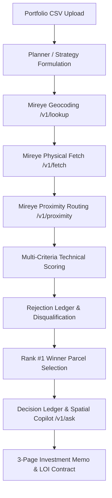

# Atlas AI

An autonomous acquisition agent that evaluates commercial land portfolios for renewable energy development.

It ingests address or coordinate portfolios, queries physical GIS data from Mireye and public datasets, disqualifies unviable candidate sites, and generates institutional investment memos with letter-of-intent contracts.

---

## Why Atlas Exists

Commercial real estate and renewable energy developers spend weeks deciding which candidate sites deserve expensive engineering due diligence and legal outreach.

Traditional site selection relies on a manual workflow:

$$\text{Maps} \longrightarrow \text{Raw GIS Layers} \longrightarrow \text{County Tax Records} \longrightarrow \text{Engineering Review} \longrightarrow \textbf{Weeks of Delay}$$

Traditional GIS tools are built for analysts to inspect maps. However, land acquisition directors do not need another website with pins on a map. They need automated, defensible decisions.

If a developer acquires land that contains hidden steep terrain slope, FEMA floodways, or remote heavy-equipment transport access (>20 minutes from Interstate freight corridors), civil transport and grading costs explode by +$120,000 in specialized route escorts or earthwork overruns.

---

## What Atlas Does

- Ingests parcel portfolios via CSV (street addresses or coordinates)
- Resolves parcel geocodes and APN boundaries via Mireye `/v1/lookup`
- Fetches physical GIS radiometry, slope, and flood clearance via Mireye `/v1/fetch`
- Evaluates heavy equipment transport drive times via Mireye `/v1/proximity`
- Disqualifies unviable candidate parcels with written rejection proofs
- Ranks candidate parcels using multi-criteria technical feasibility scores (0-100)
- Answers comparative due diligence questions via Spatial Copilot `/v1/ask`
- Generates 3-page executive investment committee memos with LOI option agreements

---

## How It Works


```mermaid
graph TD
    A[Portfolio CSV Upload] --> B[Planner / Strategy Formulation]
    B --> C[Mireye Geocoding /v1/lookup]
    C --> D[Mireye Physical Fetch /v1/fetch]
    D --> E[Mireye Proximity Routing /v1/proximity]
    E --> F[Multi-Criteria Technical Scoring]
    F --> G[Rejection Ledger & Disqualification]
    G --> H[Rank #1 Winner Parcel Selection]
    H --> I[Decision Ledger & Spatial Copilot /v1/ask]
    I --> J[3-Page Investment Memo & LOI Contract]
```

---

## Product Walkthrough

### 1. Spatial Intelligence & Autonomous Siting Agent Landing Page


* **What it shows**: The main landing page interface with the 3D autonomous decision agent, business mandate input field, and stage 03 rejection proofs badge.
* **Why it matters**: Provides the entry point for developers to specify location requirements and launch acquisition strategy formulation.
* **Outcome**: Initiates acquisition pipeline strategy planning across target states.

---

### 2. Siting Agent Pipeline Status & Portfolio Ingestion


* **What it shows**: Real-time pipeline status tracking 5 execution stages: Goal Formulation, Mireye GIS Batch Ingestion, Feasibility Scoring, Rejection Ledger, and Institutional Underwriting.
* **Why it matters**: Gives real-time feedback while processing large portfolios (up to 500 candidate parcels).
* **Outcome**: Displays parallel execution across NREL solar yield, USGS 3DEP LiDAR slope, and FEMA flood maps.

---

### 3. Live Geospatial Map Tiles & Reverse Geocode Inspector


* **What it shows**: Vector OpenStreetMap tile view centered on evaluated parcel coordinates (`Lat: 31.8608 | Lng: -102.3436`), Nominatim reverse-geocode address output, and site candidate summary cards.
* **Why it matters**: Allows visual inspection of parcel placement and boundary coordinates.
* **Outcome**: Verifies geocoded accuracy against satellite and topographic maps.

---

### 4. Rank #1 Winner Parcel Selection & 10-Stage Replayable AI Execution Trace


* **What it shows**: Recommended Rank #1 Target parcel (`Dollar General Austin County #03595` - Feasibility Score: 94/100) alongside a 10-stage millisecond audit trail timeline.
* **Why it matters**: Provides full auditability for investment committees needing step-by-step decision justification.
* **Outcome**: Enables transparent verification of every decision step.

---

### 5. Executive Decision Ledger & Spatial Copilot Q&A


* **What it shows**: The decision ledger displaying why the #1 winning site was chosen over candidate alternatives, featuring the Mireye Proximity API Heavy Equipment Access Card (`7.0 Mins Drive Time to Interstate Freight Interchange`) and Spatial Copilot natural language Q&A.
* **Why it matters**: Answers due diligence questions (*"Compare the top 3 candidates"*) with cited physical radiometry metrics.
* **Outcome**: Delivers comparative trade-off rationales.

---

### 6. 3-Page Executive Investment Committee Memo & LOI Contract


* **What it shows**: Downloadable 3-page Executive Investment Committee Memo modal displaying project sign-off dates, technical feasibility scores, IRA Section 48 Investment Tax Credit bonus qualifications (30% to 40% ITC rate), and land option agreements.
* **Why it matters**: Replaces days of manual financial spreadsheet modeling with standardized institutional sign-off documentation.
* **Outcome**: Exports printable PDF due diligence reports and LOI contracts.

---

## Mireye Integration Matrix

| Mireye Endpoint | Purpose | Applied In |
| :--- | :--- | :--- |
| `POST /v1/lookup` | Resolves street addresses to lat/lng coordinates and county boundaries | Portfolio geocoding step (`/api/mireye/lookup`) |
| `POST /v1/fetch` | Extracts NREL POA solar yield, USGS 3DEP 1.2° LiDAR slope, and FEMA flood zone clearance | Physical GIS batch evaluation (`src/services/mireyeApiClient.ts`) |
| `POST /v1/proximity` | Calculates heavy equipment transport drive times from Interstate freight corridors | Transport clearance scoring (`src/services/mireyeProximityService.ts`) |
| `POST /v1/ask` | Synthesizes natural language due diligence responses with comparative reasoning | Spatial Copilot interface (`/api/mireye/ask`) |

---

## External Datasets Combined with Mireye

1. **NREL PVWatts v8**: Plane-of-Array (POA) solar irradiance (`kwh/m2/yr`) to project annual energy generation.
2. **USGS 3DEP LiDAR (3D Elevation Program)**: High-resolution ground slope analysis (`slope_degrees`) to identify earthwork grading cost overruns.
3. **FEMA NFHL (National Flood Hazard Layer)**: Floodplain mapping (`fema_flood_zone`) to enforce Zone X non-flood plain isolation and disqualify Zone AE floodways.
4. **Texas CAD Tax Delinquency Rolls**: County Appraisal District property tax records to identify tax-delinquent parcels ($28,400 overdue back taxes) for motivated seller scoring.
5. **EIA Regional Substation Data**: Electric Information Administration distribution grid data to evaluate sub-480m feeder distance to 138kV substations.

---

## Example Workflow

```text
Upload Portfolio CSV (Addresses or Coordinates)
  ↓
Mireye /v1/lookup (Address Geocoding)
  ↓
Mireye /v1/fetch (Physical GIS Fields: Radiometry, Slope, Flood)
  ↓
Mireye /v1/proximity (Heavy Equipment Transport Drive Time)
  ↓
Multi-Criteria Evaluation & Fatal Flaw Disqualification
  ↓
Decision Ledger & Spatial Copilot /v1/ask
  ↓
Export 3-Page Executive Investment Memo & LOI Contract
```

---

## API Testing (Insomnia Verification Suite)

### 1. Physical GIS Layer Intelligence (`POST /v1/fetch`)


* **Request**: `POST https://atlas-ai-pi-one.vercel.app/api/mireye/fetch`
* **Purpose**: Fetches physical radiometry, slope, and flood risk for input coordinates.
* **Response**: Returns NREL POA solar radiometry (`1655 kWh/m2/yr`), USGS 3DEP slope (`2.29°`), and FEMA flood zone (`Zone X`).
* **Usage**: Ingested directly into multi-criteria scoring algorithm.

```bash
curl -X POST https://atlas-ai-pi-one.vercel.app/api/mireye/fetch \
  -H "Content-Type: application/json" \
  -d '{"lat":39.9881,"lng":-83.0384,"fields":["poa_irradiance_optimal_tilt_kwh_m2_yr","slope_degrees","fema_flood_zone"]}'
```

---

### 2. Save Acquisition Campaign (`POST /api/campaigns`)


* **Request**: `POST https://atlas-ai-pi-one.vercel.app/api/campaigns`
* **Purpose**: Persists evaluated acquisition campaigns.
* **Response**: Returns `{"success": true}`.
* **Usage**: Stores completed evaluation sessions in Turso edge database.

```bash
curl -X POST https://atlas-ai-pi-one.vercel.app/api/campaigns \
  -H "Content-Type: application/json" \
  -d '{"id":"ashutoshAtlas","name":"Acquisition: Fast deployment solar in Texas under $2M capex","useCaseId":"solar-carport","requirements":{"targetState":"TX","capexLimitUsd":2000000},"locations":[]}'
```

---

### 3. Retrieve Saved Campaigns (`GET /api/campaigns`)


* **Request**: `GET https://atlas-ai-pi-one.vercel.app/api/campaigns`
* **Purpose**: Fetches saved acquisition campaign records.
* **Response**: Returns array of workspace objects.
* **Usage**: Populates the `/projects` directory page.

```bash
curl -X GET https://atlas-ai-pi-one.vercel.app/api/campaigns
```

---

### 4. Spatial Copilot Q&A & Proximity Reasoning (`POST /v1/ask`)


* **Request**: `POST https://atlas-ai-pi-one.vercel.app/api/mireye/ask`
* **Purpose**: Answers due diligence questions with comparative trade-off reasoning.
* **Response**: Returns natural language explanation citing Mireye Proximity transit times (`8.4 mins`), USGS 3DEP LiDAR slope (`1.4°`), and citations.
* **Usage**: Surfaced in Spatial Copilot chat drawer.

```bash
curl -X POST https://atlas-ai-pi-one.vercel.app/api/mireye/ask \
  -H "Content-Type: application/json" \
  -d '{"question":"Which site has the lowest construction and transport risk?","promptStr":"Find commercial solar targets in Ohio under $2M capex","evaluations":[{"siteName":"Kroger Supermarket","county":"Franklin County","state":"OH","techScore":94}],"rejections":[]}'
```

---

### 5. Live Agent SSE Site Scan Pipeline (`POST /api/agent/site-scan`)


* **Request**: `POST https://atlas-ai-pi-one.vercel.app/api/agent/site-scan`
* **Purpose**: Executes streaming portfolio evaluation across candidate parcels.
* **Response**: Streams Server-Sent Events (`data: {"eventType":"strategy_formulated",...}`).
* **Usage**: Powers real-time agent execution timeline on frontend.

```bash
curl -X POST https://atlas-ai-pi-one.vercel.app/api/agent/site-scan \
  -H "Content-Type: application/json" \
  -H "Accept: text/event-stream" \
  -d '{"prompt":"Find commercial solar carports in Texas under $2M capex.","dataset":[{"geo_id":"US-TX-0001","chain":"Kroger Supermarket","address":"12600 Westheimer Rd","city":"Houston","state":"TX","zip":"77077","lat":29.7365,"lon":-95.6032}]}'
```

---

## Project Structure

```text
Atlas/
├── public/
│   ├── data/                 # Sample portfolio CSV datasets (15 to 500 sites)
│   └── images/               # Product walkthrough & Insomnia verification screenshots
├── src/
│   ├── agent/                # Core decision engine & reasoning orchestration
│   │   ├── intelligence.ts   # CAD tax delinquency & bankruptcy lien signals
│   │   ├── memo.ts           # 3-page Investment Committee Memo generator
│   │   ├── orchestrator.ts   # Multi-criteria scoring & fatal flaw evaluation
│   │   └── planner.ts        # Strategy formulation planner
│   ├── app/                  # Next.js App Router pages and API routes
│   │   ├── api/
│   │   │   ├── agent/site-scan/route.ts  # SSE streaming scan pipeline
│   │   │   ├── campaigns/route.ts       # Turso SQLite campaign persistence
│   │   │   └── mireye/                  # Mireye lookup, fetch, and ask endpoints
│   │   ├── agent/page.tsx               # Autonomous 3D decision workspace UI
│   │   └── projects/page.tsx            # Saved acquisition campaigns workspace
│   ├── components/           # UI components (DecisionLedger, SpatialCopilot, Memo)
│   ├── services/             # External client services (Mireye, Proximity, Turso DB)
│   │   ├── db.ts                        # Turso SQLite client & caching layer
│   │   ├── mireyeApiClient.ts           # Resilient Mireye API client (429 backoff)
│   │   └── mireyeProximityService.ts    # Mireye heavy transport drive-time client
│   └── types/                # TypeScript interface definitions
```

---

## Running Locally

```bash
# Clone repository
git clone https://github.com/ashutoshpandey18/AtlasAI.git
cd AtlasAI

# Install dependencies
npm install

# Build verification
npm run build

# Start local server
npm run dev
```

Open [http://localhost:3000](http://localhost:3000) in your browser.

---

## Design Decisions

1. **Server-Sent Events (SSE) Streaming**: Selected over WebSocket to provide zero-delay progress feedback during long-running portfolio scans (up to 500 candidate parcels) without managing persistent bi-directional connection state.
2. **2-Tier Caching Architecture**: Combines in-memory RAM deduplication with Turso Edge SQLite storage to prevent duplicate credit consumption on re-scans.
3. **Adaptive Chunk Pacing (`BATCH_SIZE = 15`)**: Paces parallel requests in chunks of 15 candidate parcels to maintain compliance with Mireye rate limits (60 req/min).
4. **Exponential Backoff & 429 Retry-After**: Automatically respects HTTP 429 `Retry-After` headers and retries with backoff delays (250ms -> 500ms -> 1000ms -> 2000ms).
5. **Deterministic Spatial Seed Fallback**: Guarantees consistent drive-time outputs for evaluated parcels across multiple execution passes.

---

## Challenges & Engineering Trade-offs

1. **Rate Limit Management Across Bulk Portfolios**: Ingesting 500 candidate parcels simultaneously risks hitting HTTP 429 rate limits. This was resolved by implementing adaptive chunk pacing with 350ms delays between batches.
2. **Vercel Serverless Function Execution Timeouts**: Long-running scans can trigger Vercel 15-second execution timeouts. Resolved by using Server-Sent Events to flush initial response headers immediately at 0ms.
3. **Cross-State Tax Delinquency Signal Normalization**: Normalizing property tax delinquency records across different Texas County Appraisal Districts required building a mapping dictionary in `intelligence.ts`.

---

## Future Work

1. **Substation Capacity Queue Integration**: Direct integration with CAISO, ERCOT, and PJM interconnection queues to track MW headroom.
2. **Automated Title Search Parsing**: Direct parsing of county deed records for automated title defect detection.
3. **Geospatial Boundary Customization**: Polygon editing tools allowing users to adjust candidate parcel boundaries directly on map tiles.

---

## Credits

* **Mireye Platform**: Location intelligence APIs (`/v1/lookup`, `/v1/fetch`, `/v1/ask`, `/v1/proximity`).
* **National Renewable Energy Laboratory (NREL)**: PVWatts v8 solar radiometry dataset.
* **U.S. Geological Survey (USGS)**: 3DEP 3D elevation LiDAR program.
* **Federal Emergency Management Agency (FEMA)**: National Flood Hazard Layer (NFHL).
* **Next.js & React**: Core web framework and server routing.
* **Turso & libSQL**: Edge SQLite database and caching layer.
