# Atlas

An autonomous land-acquisition screening and underwriting agent that turns candidate parcels into defensible acquisition decisions using physical-world evidence.

*Mireye provides physical-world evidence and spatial intelligence; Atlas provides decision logic, screening rules, scoring, ranking, orchestration, persistent site registration, and investment underwriting.*

---

## The Problem

Commercial renewable-energy developers spend weeks screening candidate properties for solar carports, ground-mount solar, and battery energy storage systems (BESS). Gross parcel acreage alone does not determine site viability. A candidate parcel can appear attractive geographically while carrying hidden physical risks:

* **Terrain Slope**: Steep ground slope introduces civil cut-and-fill grading overruns exceeding $145,000 per acre.
* **Floodways**: Encroachment into FEMA 100-year Zone AE Special Flood Hazard Areas requires base flood elevation engineering and introduces prohibitive commercial flood insurance premiums (+18% to +22% CapEx overrun).
* **Wetlands & Canopy**: Dense timber canopy cover and USFWS wetland buffer setbacks restrict net developable footprint.
* **Transport Logistics**: Heavy 50-ton transformer deliveries require verified freight corridor clearance within 15 minutes of an Interstate interchange.
* **Tax Delinquency**: Delinquent back taxes ($28,400+ overdue across 2+ years) signal motivated seller options for land acquisition outreach.

Early-stage site selection fails not from a lack of geographic data, but because physical evidence is fragmented across isolated portals.

**The central engineering problem is: How do we move from a list of candidate parcels to a defensible acquisition priority using physical evidence?**

---

## What Atlas Does

Atlas automates the end-to-end site screening and underwriting workflow:

1. **Ingests Candidate Portfolios**: Accepts CSV street address lists or GeoJSON boundary files containing target siting requirements.
2. **Resolves Location & Parcel Context**: Geocodes addresses to latitude/longitude coordinates and county boundaries via Mireye `POST /v1/lookup`.
3. **Retrieves Physical Evidence**: Queries USGS 3DEP LiDAR elevation, FEMA NFHL flood risk, NREL PVWatts v8 solar yield, and heavy transport drive-time routing via Mireye `POST /v1/fetch` and `POST /v1/proximity`.
4. **Applies Fatal-Flaw Screening & Multi-Factor Scoring**: Evaluates hard constraints, calculates Technical Feasibility Scores ($0–100$), and ranks acquisition priority based on corporate fee-simple title and tax delinquency.
5. **Registers Winning Parcels**: Promotes the Rank #1 candidate and registers its GeoJSON polygon boundary with Mireye `POST /v1/sites` to establish a persistent Site Dossier (`site_id`).
6. **Executes Site Diligence & Underwriting**: Powers a dual-mode Spatial Copilot (`POST /v1/ask-site` for site dossier Q&A vs `/api/mireye/ask` for portfolio trade-offs) and generates a 3-page institutional investment committee memo.

---

## System Architecture & How It Works

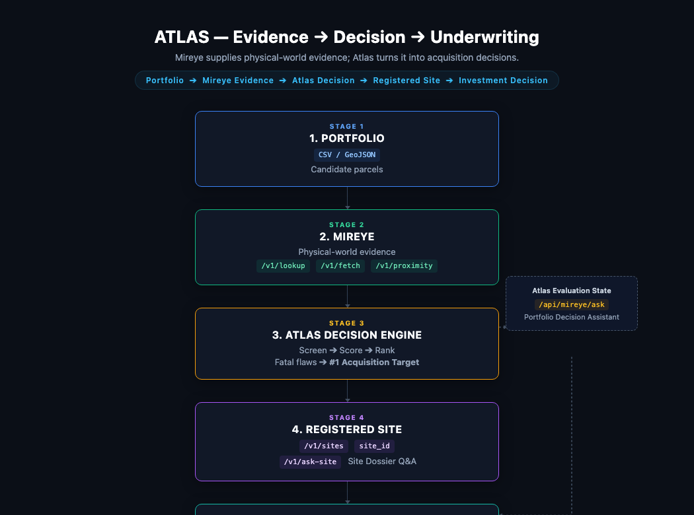

*Mireye provides physical-world evidence; Atlas turns that evidence into acquisition decisions and underwriting.*

### Core Pipeline Sequence
$$\text{Portfolio Ingestion} \longrightarrow \text{Mireye Physical Intelligence} \longrightarrow \text{Atlas Decision Engine} \longrightarrow \text{Site Registration} \longrightarrow \text{Due Diligence \& Underwriting}$$


```mermaid
flowchart TD
    classDef stage1 fill:#1e293b,stroke:#3b82f6,stroke-width:2px,color:#fff;
    classDef stage2 fill:#14532d,stroke:#22c55e,stroke-width:2px,color:#fff;
    classDef stage3 fill:#78350f,stroke:#f59e0b,stroke-width:2px,color:#fff;
    classDef stage4 fill:#581c87,stroke:#a855f7,stroke-width:2px,color:#fff;
    classDef stage5 fill:#134e4a,stroke:#14b8a6,stroke-width:2px,color:#fff;

    subgraph STAGE1["STAGE 1 · Portfolio Ingestion"]
        UP["User Portfolio<br/>(CSV / GeoJSON candidate parcels)"] --> API["Atlas Portfolio Ingestion<br/>(Normalizes site records:<br/>address, coordinates, parcel context)"]
    end

    subgraph STAGE2["STAGE 2 · Mireye Physical Intelligence"]
        LOOKUP["POST /v1/lookup<br/>(Address / coordinate ➔ parcel context)"] --> FETCH["POST /v1/fetch<br/>(Point-level physical evidence:<br/>USGS 3DEP slope, FEMA NFHL flood indicator,<br/>NREL PVWatts solar, Wetland / canopy)"]
        FETCH --> PROX["POST /v1/proximity<br/>(Transport & logistics proximity)"]
    end

    subgraph STAGE3["STAGE 3 · Atlas Decision Engine"]
        EVID["Mireye Evidence<br/>(Source-backed point-level)"] --> FFS["Fatal-Flaw Screening<br/>(Atlas Screening Rules)"]
        FFS --> MFE["Multi-Factor Evaluation"]
        MFE --> TFS["Technical Feasibility Score"]
        TFS --> PAR["Priority / Acquisition Ranking"]
        PAR --> DEC{"Candidate Decision"}
        DEC -- "rejected" --> REJ["Rejection Evidence<br/>(Decision Ledger)"]
        DEC -- "survivor" --> SURV["Ranked Candidate<br/>(Survivor)"]
        SURV --> TARGET["#1 Acquisition Target"]
    end

    subgraph STAGE4["STAGE 4 · Site Registration & Persistence"]
        SITES["POST /v1/sites<br/>(Registers valid parcel geometry)"] --> RMS["Registered Mireye Site<br/>(Persistent site identity)"]
        RMS --> SID["site_id<br/>(Handle for downstream calls)"]
    end

    subgraph STAGE5["STAGE 5 · Due Diligence & Underwriting"]
        ASKSITE["POST /v1/ask-site<br/>(Registered-site dossier Q&A)"] --> DOSSIER["Mireye Site Dossier Q&A<br/>(Source-backed answers)"]
        ASK["POST /v1/ask<br/>(Secondary fallback)"] -. "fallback" .-> PDA["Portfolio Decision Assistant<br/>(CFO / acquisition trade-off questions)"]
        EVAL["Atlas Evaluation State"] -.-> PDA
        DOSSIER --> UW["Atlas Underwriting<br/>(Financial modeling over Mireye evidence + Atlas calculations)"]
        PDA --> UW
        UW --> MEMO["Executive Investment Memo<br/>(Source-backed Mireye evidence + Atlas calculations<br/>• clearly labeled financial assumptions)"]
        MEMO --> ITC["Illustrative Atlas Financial Assumption<br/>(30% §48 ITC — modeled assumption,<br/>not Mireye data & not a guaranteed tax benefit)"]
    end

    API -- "site records" --> LOOKUP
    PROX --> EVID
    TARGET -- "#1 target" --> SITES
    SID -- "site_id" --> ASKSITE

    class STAGE1,UP,API stage1;
    class STAGE2,LOOKUP,FETCH,PROX stage2;
    class STAGE3,EVID,FFS,MFE,TFS,PAR,DEC,REJ,SURV,TARGET stage3;
    class STAGE4,SITES,RMS,SID stage4;
    class STAGE5,ASKSITE,DOSSIER,ASK,EVAL,PDA,UW,MEMO,ITC stage5;
```

### Key Architectural Responsibilities
* **Mireye**: Location & physical intelligence (`/v1/lookup`, `/v1/fetch`, `/v1/proximity`, `/v1/sites`, `/v1/ask-site`, `/v1/ask`).
* **Atlas**: Screening, scoring, ranking, decision logic, and financial underwriting modeling.
* **`/v1/sites`**: Persistent site identity registration.
* **`/v1/ask-site`**: Registered-site dossier Q&A interface.
* **Atlas Underwriting**: Financial modeling and investment committee memo generation.

---

## Mireye Integration

Atlas integrates across 6 Mireye endpoints:

| Mireye Endpoint | Request Payload | Response Data | How Atlas Uses It | Execution Mode | Limitations |
| :--- | :--- | :--- | :--- | :---: | :--- |
| **`POST /v1/lookup`** | `{ address, apn, state }` | `{ lat, lng, county, state }` | Resolves street addresses to lat/lng and county context | Live HTTP POST / Edge Cache (`mireye-lookup-v3:*`) | Synthetic test addresses fall back to hash-based coordinate offsets |
| **`POST /v1/fetch`** | `{ lat, lng, fields: [...] }` | `{ fields: { slope_degrees, within_floodplain_polygon, poa_irradiance... } }` | Queries USGS 3DEP LiDAR, FEMA NFHL flood, and NREL solar rasters | Live HTTP POST / Edge Cache (`mireye-fetch:*`) | Returns point-level scalar indicators at parcel centroid, not complete raster grids |
| **`POST /v1/proximity`** | `{ origins, destinations, mode: "driving" }` | `{ legs: [{ duration_minutes, distance_miles }] }` | Calculates heavy equipment freight drive-time routing | Live HTTP POST / Turso Edge DB | Routing evaluated from origin point to target interstate interchange |
| **`POST /v1/sites`** | `{ site: GeoJSON Polygon }` | `{ site_id, status: "registered" }` | Registers winning parcel geometry to create persistent site dossier | Live HTTP POST | Requires valid GeoJSON Polygon; registration deferred if geometry unavailable |
| **`POST /v1/ask-site`** | `{ site_id, question }` | `{ answer, traceSteps, citations }` | Answers grounded due diligence queries against persistent site dossier | Live HTTP POST (Primary Dossier Path) | Requires valid registered `site_id` (4–64 chars); times out at 120s |
| **`POST /v1/ask`** | `{ question, lat, lng, context }` | `{ answer, traceSteps, citations }` | Answers comparative portfolio trade-off and CFO underwriting queries | Live HTTP POST (Stateless Fallback) | Stateless re-fetch route used for portfolio-wide questions or unregistered sites |

### Live vs. Cached Execution Discipline
* **`LIVE MIREYE RESULT`**: Executed live against `api.mireye.com` during an active user session (`liveRequestExecuted: true`, HTTP 200).
* **`CACHED MIREYE RESULT`**: Served from edge cache (`getCache()`) to prevent duplicate credit consumption on re-evaluations. A cached response is Mireye-derived evidence, but not a live request executed during the current session.

---

## Evidence → Decision Model

Atlas adheres to a strict 6-tier evidence hierarchy: **Atlas calculations and financial assumptions are never presented as raw Mireye facts.**

```text
┌──────────────────────────────────────────────────────────────────────────┐
│                         EVIDENCE HIERARCHY MODEL                         │
├───────────────────────────────┬──────────────────────────────────────────┤
│ Provenance Category           │ Definition & System Handling             │
├───────────────────────────────┼──────────────────────────────────────────┤
│ 1. MIREYE EVIDENCE            │ Physical signals returned from Mireye    │
│                               │ (/v1/lookup, /v1/fetch, /v1/proximity).  │
│ 2. ATLAS CALCULATION          │ Deterministic outputs computed by Atlas  │
│                               │ (Technical Feasibility Score, Area).     │
│ 3. ATLAS DECISION RULE        │ Business/screening rule defined by Atlas │
│                               │ (Slope > 6.0° cut, Zone AE flood cut).   │
│ 4. MODELING ASSUMPTION        │ Pre-feasibility financial parameter      │
│                               │ ($2,200/kW CapEx, 30% §48 ITC tax credit).│
│ 5. USER INPUT                 │ Boundary geometry or mandate parameter   │
│                               │ (CSV upload, target state filter).       │
│ 6. REQUIRES EXTERNAL DILIGENCE│ Unverified data requiring third-party    │
│                               │ survey (ALTA title, Phase 1 ESA).        │
└───────────────────────────────┴──────────────────────────────────────────┘
```

### Fatal-Flaw Screening Rules (Atlas Decision Rules)
* **FEMA Floodway Encroachment**: Parcels where `within_floodplain_polygon = true` trigger a **FATAL** cut (`FLOODPLAIN`). Siting within Zone AE floodways requires base flood elevation engineering and introduces prohibitive flood insurance premiums (+18% to +22% CapEx overrun).
* **Steep LiDAR Ground Slope**: Ground slope is evaluated against physical racking limits:
  * **Solar Carport / Utility Solar**: Ground slope $> 6.0^\circ$ triggers a **FATAL** cut (`SLOPE`), exceeding single-axis tracker racking tolerances and creating $+ \$145,000/\text{acre}$ civil grading overruns.
  * **BESS Storage Pad**: Ground slope $> 3.5^\circ$ triggers a **FATAL** cut (`SLOPE`), exceeding concrete foundation pad leveling tolerances.
* **Tree Canopy Density**: Tree canopy cover $> 35.0\%$ triggers a **HIGH_RISK** encumbrance (`CANOPY`), requiring timber clearing and shading mitigation.

### Technical Feasibility Score Formula (Atlas Calculation: $0 – 100$)
$$\text{POA Points} = \text{Clamp}\left(\frac{\text{POA} - 1700}{2500 - 1700}, 0, 1\right) \times 40 \quad (\text{Weight } 40\%)$$
$$\text{Slope Points} = \max\left(0, \frac{6.0 - \min(\text{slope}, 6.0)}{6.0}\right) \times 35 \quad (\text{Weight } 35\%)$$
$$\text{Canopy Points} = \max\left(0, \frac{35 - \min(\text{canopy}, 35)}{35}\right) \times 25 \quad (\text{Weight } 25\%)$$
$$\text{TechnicalScore} = \text{Round}(\text{POA Points} + \text{Slope Points} + \text{Canopy Points})$$
*If a fatal flaw is detected, $\text{TechnicalScore}$ is capped at a maximum of $28$.*

### Acquisition Priority Score Formula (Atlas Calculation: $72\% – 99\%$)
* **Fee-Simple Corporate Baseline**: Verified corporate fee-simple title on county CAD tax rolls establishes a base priority score between $72\%$ and $97\%$.
* **Tax Delinquency Boost**: Delinquent back taxes ($28,400+ overdue across 2+ years) boost priority score to **$92\% – 99\%$**, indicating strong owner option agreement leverage.

---

## Site Registration & Dossier (`POST /v1/sites`)

Only surviving candidate parcels recommended for acquisition are promoted for registration:

```text
Winning Candidate  ──►  POST /v1/sites  ──►  Returns site_id (e.g. 4a32309517709caa)  ──►  Status: "Registered"
```

* **Geometry Policy**: Registration requires a valid GeoJSON `Polygon` or `MultiPolygon`. If parcel geometry is unavailable, registration is deferred (`status: 'deferred'`, `reason: 'No parcel geometry available'`).
* **Truthful UI State**: The UI displays `Registered` only when the HTTP POST call to `https://api.mireye.com/v1/sites` succeeds and returns a valid 16-hex `site_id`.
* **Fallback Route**: If registration is deferred or fails, Spatial Copilot automatically routes due diligence questions through stateless `POST /v1/ask`.

---

## Portfolio Decision Assistant (`/api/mireye/ask`)

Spatial Copilot separates portfolio-level trade-off questions from site-dossier due diligence:

### 1. Site Dossier Mode (`POST /v1/ask-site`)
* **Primary Site-Specific Path**: Queries physical terrain, flood risks, canopy, and infrastructure on a persistent registered `site_id`.
* **Source**: Mireye Site Dossier index.

### 2. Portfolio Decision Mode (`/api/mireye/ask`)
* **Portfolio Trade-Off Path**: Evaluates candidate rankings ("Why Rank #1 over Rank #2?"), rejection trade-off proofs, and CFO underwriting explanations across the complete candidate dataset.
* **Source**: Atlas evaluated application context.

---

## Underwriting

The 3-Page Executive Investment Memo compiles physical evidence, Atlas calculations, and commercial financial assumptions into an underwriting document:

* **Source-Backed Facts (Mireye Evidence)**: USGS 3DEP slope ($1.7^\circ$ in illustrative run), FEMA NFHL flood clearance (Zone X), NREL PVWatts solar yield ($2,324\text{ kWh/m}^2/\text{yr}$), freight drive time ($13.7\text{ min}$).
* **Atlas Calculations**: Technical Feasibility Score ($71/100$ in illustrative run), Estimated Net Developable Area ($15.6\text{ Acres}$).
* **Modeling Assumptions**: Gross CapEx baseline ($2,200/\text{kW}$), statutory IRA 30% §48 Investment Tax Credit ($34k\text{ USD}$), projected Net Equity IRR ($28.6\%$). *Tax credits and IRRs are pre-feasibility modeling inputs, not financial guarantees.*

---

## Evidence Boundaries

Atlas explicitly documents its operational boundaries:

* **Point-Level Sampling Scope**: Mireye `/v1/fetch` queries rasters at parcel centroids; whole-parcel zonal statistics require registered site dossiers (`/v1/ask-site`).
* **Pre-Feasibility Deduction Model**: Where source constraint geometries (such as exact wetland polygons or utility easement corridors) are unavailable, Atlas applies a **Civil Deduction Model** (WGS84 geodesic polygon math with inner-ring hole subtraction). This is an Atlas estimate, not authoritative vector constraint polygon clipping.

---

## What Is Real Today

| Capability | Status | File / Implementation Reference |
| :--- | :---: | :--- |
| **Address & APN Lookup** | **Implemented** | `src/app/api/mireye/lookup/route.ts` |
| **Physical Signal Fetch** | **Implemented** | `src/app/api/mireye/fetch/route.ts` |
| **Transport Routing** | **Implemented** | `src/services/mireyeProximityService.ts` |
| **Target Site Registration** | **Implemented** | `src/app/api/mireye/sites/route.ts` |
| **Registered Site Q&A** | **Implemented** | `src/app/api/mireye/ask-site/route.ts` |
| **Portfolio Reasoning** | **Implemented** | `src/app/api/mireye/ask/route.ts` |
| **Deterministic Scoring** | **Implemented** | `src/agent/evaluator.ts` & `src/agent/intelligence.ts` |
| **3-Page Investment Memo** | **Implemented** | `src/components/InvestmentMemoModal.tsx` |
| **Turso Edge SQLite Cache** | **Implemented** | `src/services/db.ts` (`@libsql/client`) |
| **Geodesic Area Calculation** | **Implemented** | `src/services/buildableAreaHarness.ts` |

---

## What Atlas Does Not Claim

* **Not an ALTA Survey**: Atlas does not replace professional boundary surveys, legal title examinations, or recorded easement searches.
* **Not a Phase 1 ESA**: Environmental due diligence requires physical field sampling for hazardous materials and soil borings.
* **Not an Interconnection Study**: Distance to transmission lines is measured from EIA power grid data; substation transformer capacity and ISO queue positions require utility impact studies.
* **No Vector Polygon Clipping**: Net developable area is an Atlas pre-feasibility deduction model estimate, not authoritative vector constraint polygon clipping.

---

## Future Mireye Extensions

Atlas identifies key future platform capabilities:

1. **Machine-Readable Constraint Polygons**: Exposing GeoJSON geometries for FEMA floodways, USFWS wetlands, and conservation easements would allow Atlas to perform exact vector polygon clipping.
2. **Parcel-Wide Raster Zonal Statistics**: Exposing slope distributions across entire parcel boundaries (e.g. `% of parcel > 6°`) would improve large acreage evaluation.
3. **Source Vintage Metadata**: Returning dataset retrieval timestamps (`fetched_at`, `dataset_vintage: "2024"`) in API responses would enhance compliance auditing.
4. **Substation & Queue Headroom**: Exposing distribution feeder MVA headroom and ISO interconnection queue positions would complete grid tie-in underwriting.

---

## Why Atlas Is an Agent

Atlas operates as an autonomous agent through a 10-step sequence of decisions and tool calls:

```text
1. Ingest Portfolio Mandate ──► 2. Geocode Addresses (/v1/lookup) ──► 3. Fetch Physical Signals (/v1/fetch)
                                                                                  │
6. Multi-Factor Scoring     ◄── 5. Fatal-Flaw Screening     ◄── 4. Route Proximity (/v1/proximity)
          │
          ▼
7. Rank Candidates ──► 8. Register Winner (/v1/sites) ──► 9. Site Dossier Q&A ──► 10. Underwriting Memo
```

Autonomy is defined by this execution pipeline, where each tool call produces state/evidence consumed by downstream steps.

---

## Demo Flow

### 1. Portfolio Mandate & Execution Pipeline
Select target state portfolio (e.g. Texas ERCOT grid), view physical location intelligence stack, and launch instant evaluation.

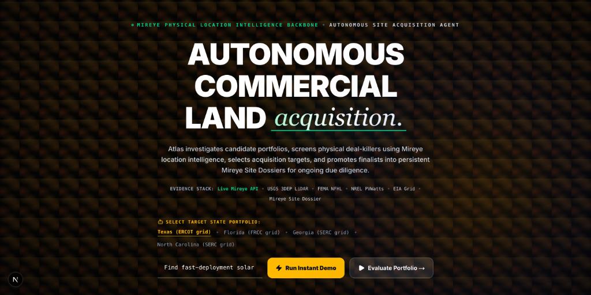

---

### 2. Live Map Inspector & Candidate Screening
Inspect candidate parcels plotted on vector maps alongside physical GIS cards (ground slope, FEMA flood clearance, NREL solar yield).

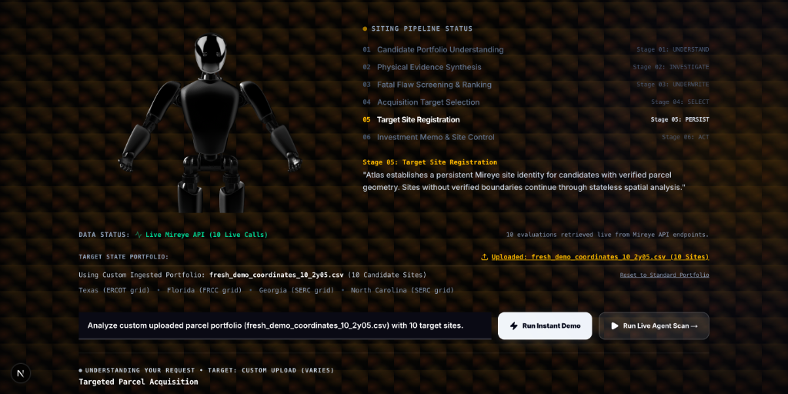

---

### 3. Registered Mireye Site Dossier
Promote winning candidate to a persistent Mireye Site Dossier (`POST /v1/sites`) with registered whole-parcel boundary geometry (`site_id`).

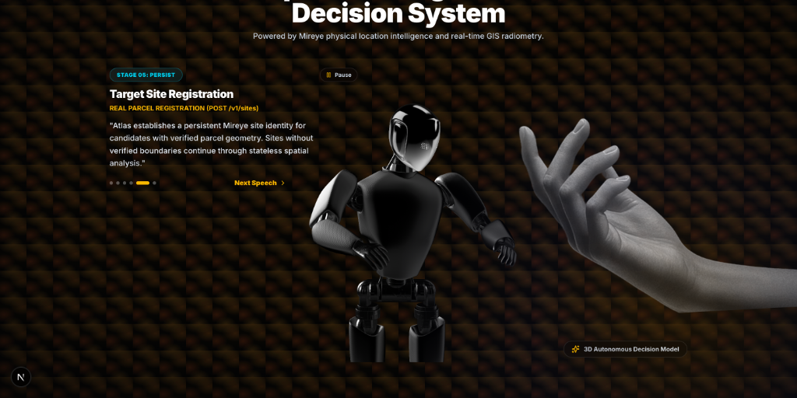

---

### 4. Candidate Comparison Matrix & Rejection Proofs
Compare surviving candidates across Technical Feasibility ($0–100$) and Acquisition Priority ($0\%–99\%$) scores alongside written disqualification proofs.

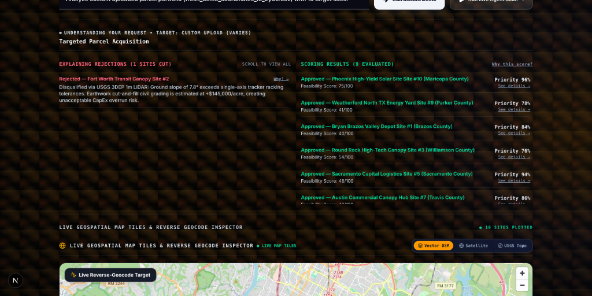

---

### 5. Dossier-Backed Spatial Copilot Q&A (`POST /v1/ask-site`)
Execute grounded physical due diligence Q&A directly against the persistent registered site dossier with cited physical evidence and execution metadata.

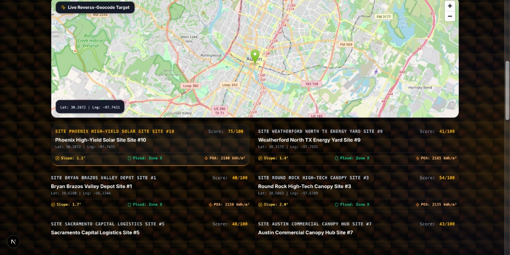

---

## Tech Stack

* **Core Framework**: Next.js 16 (App Router), React 19, TypeScript
* **Styling**: Tailwind CSS v4, Lucide React icons, Framer Motion
* **Database & Caching**: Turso Edge SQLite (`@libsql/client`)
* **3D Visualizations**: `@splinetool/react-spline`
* **Testing Engine**: Vitest (`vitest run`)
* **Location Intelligence**: Mireye APIs (`/v1/lookup`, `/v1/fetch`, `/v1/proximity`, `/v1/sites`, `/v1/ask-site`, `/v1/ask`)

---

## Run Locally

```bash
# 1. Clone repository
git clone https://github.com/ashutoshpandey18/AtlasAI.git
cd AtlasAI

# 2. Install dependencies
npm install

# 3. Environment Setup (.env.local)
# Set your Mireye and Turso database keys in .env.local:
# MIREYE_API_TOKEN=your_mireye_jwt_token
# TURSO_DATABASE_URL=libsql://your-turso-db.turso.io
# TURSO_AUTH_TOKEN=your_turso_token

# 4. Start Development Server
npm run dev

# 5. Run Unit Test Suite
npx vitest run

# 6. Execute Production Build
npx next build
```

Open [http://localhost:3000](http://localhost:3000) in your browser.

---

## Testing

Atlas includes 9 automated unit test suites covering 90 tests:

```bash
npx vitest run
```

```text
 ✓ src/services/__tests__/transportTruth.test.ts (7 tests)
 ✓ src/services/__tests__/buildableAreaHarness.test.ts (9 tests)
 ✓ src/services/__tests__/jurisdictionRisk.test.ts (17 tests)
 ✓ src/services/__tests__/centroidValidator.test.ts (22 tests)
 ✓ src/services/__tests__/gridCapacityEngine.test.ts (15 tests)
 ✓ src/services/__tests__/dataConsistencyAudit.test.ts (14 tests)
 ✓ src/services/__tests__/ownerOutreachEngine.test.ts (2 tests)
 ✓ src/services/__tests__/liveLmpGridTracker.test.ts (2 tests)
 ✓ src/services/__tests__/permittingEngine.test.ts (2 tests)

 Test Files  9 passed (9)
      Tests  90 passed (90)
```

### API Endpoint Verification (Insomnia Suite)

Atlas includes Insomnia API test suites verifying live HTTP POST route execution:

<details>
<summary>1. Physical GIS Layer Fetch (POST /api/mireye/fetch)</summary>

Queries NREL PVWatts v8 solar irradiance, USGS 3DEP 2.29° slope LiDAR, and FEMA NFHL Zone X flood clearance.

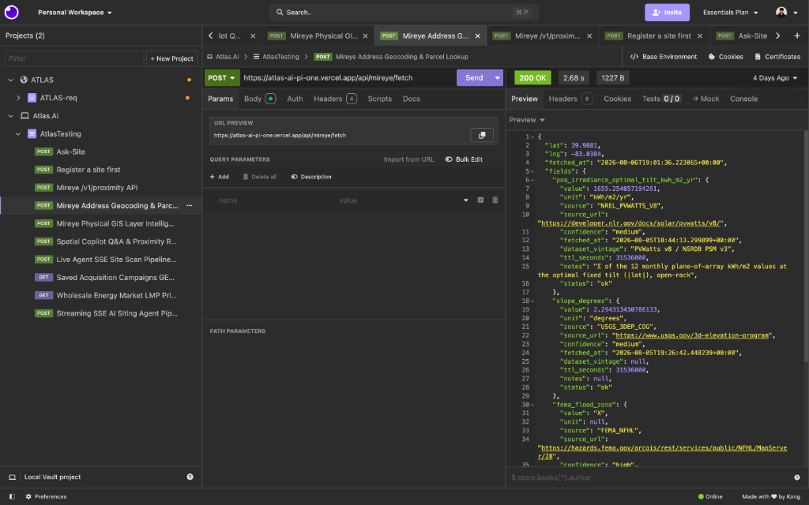
</details>

<details>
<summary>2. Freight Proximity Drive-Time Routing (POST /v1/proximity)</summary>

Calculates heavy equipment transport drive times (10.2 miles, 27.11 minutes) to freight corridors.

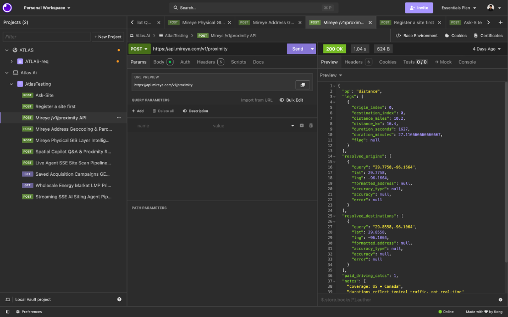
</details>

<details>
<summary>3. Target Site Registration (POST /api/mireye/sites)</summary>

Registers candidate parcel polygon geometry to create a persistent Mireye Site Dossier (`site_id: "316a948ff64cf097"`).

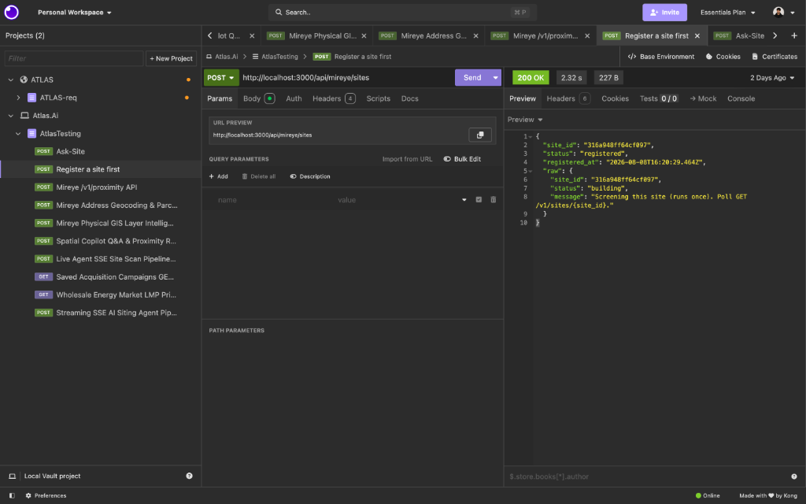
</details>

<details>
<summary>4. Grounded Site Dossier Q&A (POST /api/mireye/ask-site)</summary>

Queries persistent registered site dossier index for grounded due diligence Q&A.

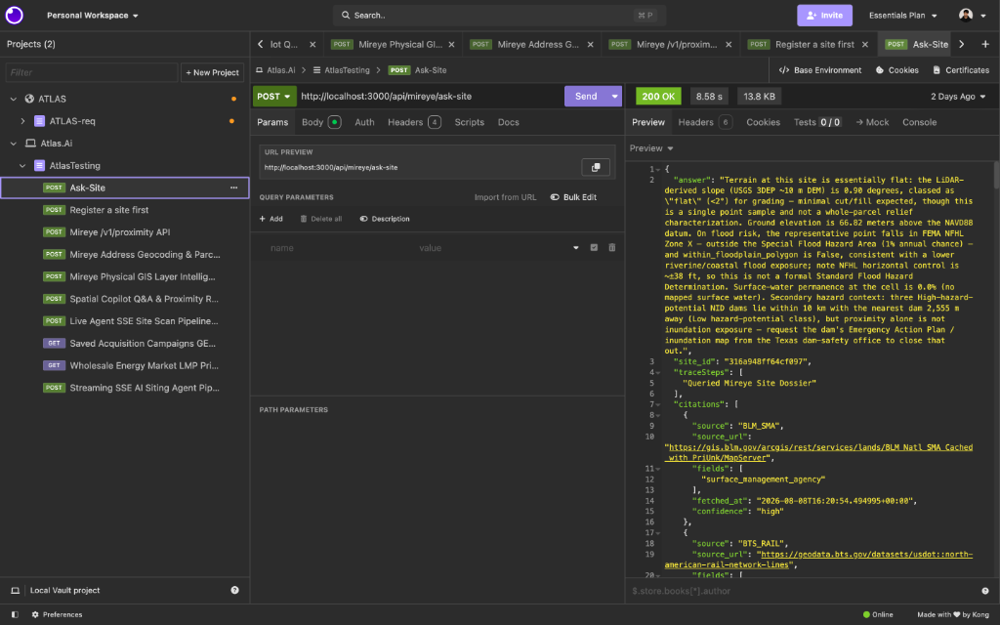
</details>

<details>
<summary>5. Save Acquisition Campaign (POST /api/campaigns)</summary>

Persists evaluated acquisition campaign run states to Turso Edge SQLite storage.

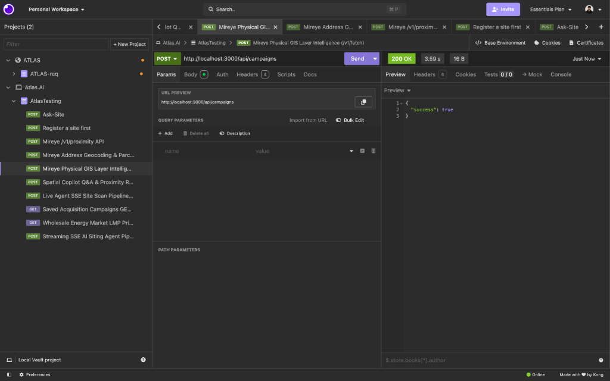
</details>

---

## Design Philosophy

> **"Atlas is valuable not because it pretends to know everything about a parcel, but because it systematically separates physical evidence, decision logic, assumptions, and remaining diligence—and turns that into an actionable acquisition decision."**
