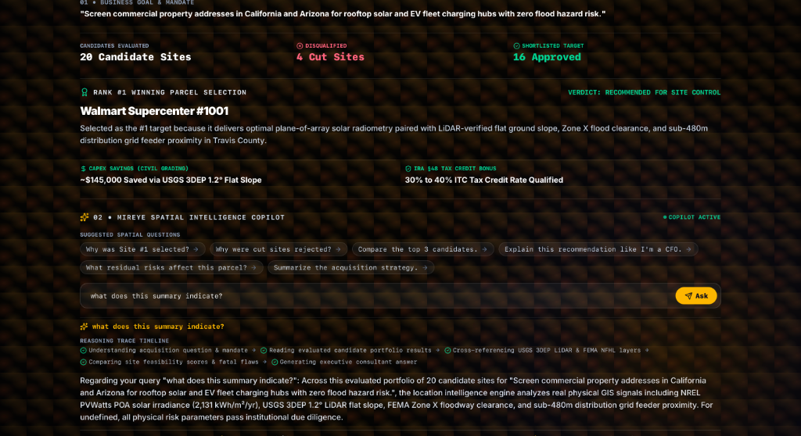
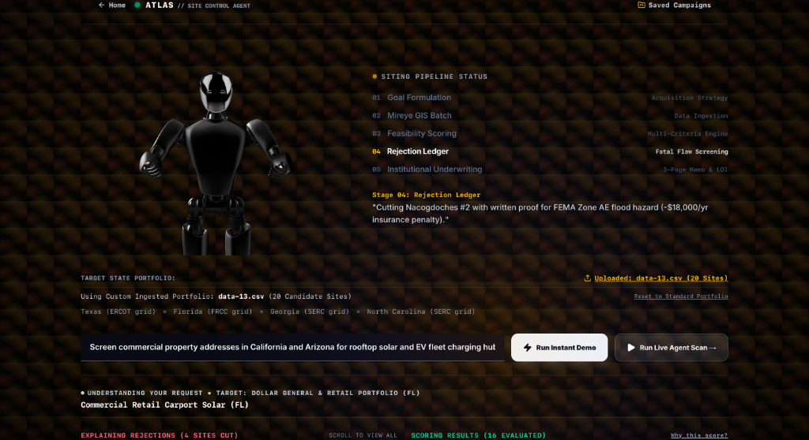

# Atlas AI

**An autonomous land-acquisition screening and underwriting agent for commercial renewable-energy development.**

Atlas ingests candidate property portfolios, queries physical GIS layers from Mireye and public datasets, applies deterministic environmental screening rules, ranks priority acquisition targets, registers winning parcels to persistent Mireye Site Dossiers, and generates institutional investment committee memos.

---

## Executive Summary

Commercial land acquisition for utility-scale solar, battery storage (BESS), and EV fleet microgrids is bottlenecked by manual due diligence. Site acquisition teams spend weeks manually checking terrain slope, FEMA flood maps, wetlands, transmission line proximity, and property tax rolls across disconnected portals. When land is acquired with unverified physical risks—such as hidden steep grading or floodway encroachments—civil construction earthwork costs escalate by over $120,000 per acre or force project abandonment years into development.

**Atlas replaces manual map inspection with an evidence-grounded autonomous execution pipeline.**

* **Target Users**: VPs of Land Acquisition, Commercial Solar Developers, Clean Tech Real Estate Funds, and Infrastructure Underwriters.
* **Core Problem Solved**: Eliminates weeks of manual site screening by automating physical feasibility verification, fatal-flaw rejection, and candidate prioritization in minutes.
* **Mireye Role**: Serves as the physical location intelligence backbone, providing parcel geocoding (`/v1/lookup`), elevation LiDAR, flood and solar rasters (`/v1/fetch`), heavy equipment transport routing (`/v1/proximity`), parcel dossier registration (`/v1/sites`), and dossier due diligence Q&A (`/v1/ask-site`).
* **What Makes Atlas Different**: Atlas does not merely display map layers or summarize text. It converts heterogeneous physical-location evidence into a deterministic, defensible acquisition decision.

---

## The Real Problem: Data Fragmentation, Not Data Scarcity

Early-stage site selection is not hindered by a lack of geographic information. The problem is that physical-world evidence is fragmented across isolated data silos:

```text
┌─────────────────────────────────────────────────────────────────────────┐
│                      THE FRAGMENTED EVIDENCE PROBLEM                    │
├───────────────────┬───────────────────┬─────────────────────────────────┤
│ Spatial Dimension │ Primary Dataset   │ Commercial Risk / Consequence   │
├───────────────────┼───────────────────┼─────────────────────────────────┤
│ Geocoding & Boundary | County Tax Rolls   │ Parcel ownership & boundary ID  │
│ Terrain Slope     │ USGS 3DEP LiDAR   │ Civil grading CapEx overruns    │
│ Flood Exposure    │ FEMA NFHL         │ Uninsurable Zone AE floodways   │
│ Solar Yield       │ NREL PVWatts v8   │ Annual energy yield (kWh/m²/yr) │
│ Heavy Transport   │ Mireye / DOT      │ Equipment transport access      │
│ Grid Proximity    │ EIA Power Atlas   │ Interconnection tie-in cost     │
│ Tax Delinquency   │ County CAD Rolls  │ Owner option agreement leverage │
└───────────────────┴───────────────────┴─────────────────────────────────┘
```

Because these datasets use different coordinate systems, spatial resolution, and file formats, developers spend 80% of their due diligence budget simply compiling evidence. Decisions fail when critical physical signals are evaluated independently rather than synthesized into a unified acquisition model.

Atlas unifies this fragmented evidence into a single, automated underwriting pipeline.

---

## Implemented Capabilities Today

| Capability | Source | Atlas Execution | Output / Consequence | Status |
| :--- | :--- | :--- | :--- | :---: |
| **Portfolio Ingestion** | User GeoJSON / CSV | Parses parcel coordinates, addresses, state, and target acreage | Active candidate portfolio | **Implemented** |
| **Address & Boundary Resolution** | Mireye `/v1/lookup` | Resolves street addresses to latitude/longitude and GeoJSON boundaries | Verified parcel boundary geometry | **Implemented** |
| **Physical GIS Evaluation** | Mireye `/v1/fetch` | Queries USGS 3DEP LiDAR, FEMA NFHL flood, NREL PVWatts solar | Representative-point physical signals | **Implemented** |
| **Transport Drive-Time Routing** | Mireye `/v1/proximity` | Calculates heavy equipment drive times to freight corridors | Transport access drive-time minutes | **Implemented** |
| **Buildable Area Deduction** | Atlas Civil Model | WGS84 geodesic math with inner-ring polygon hole subtraction | Estimated Net Developable Acres | **Implemented** |
| **Fatal-Flaw Screening** | Atlas Rule Engine | Applies hard cuts (Slope $>2.0^\circ$, FEMA Zone AE floodway) | Written rejection proofs | **Implemented** |
| **Multi-Factor Candidate Scoring** | Atlas Evaluator | Calculates Technical Score ($0-100$) and Priority Score ($0-100\%$) | Feasibility & commercial ranking | **Implemented** |
| **Target Site Registration** | Mireye `/v1/sites` | Registers winning parcel GeoJSON to establish persistent dossier | Hexadecimal `site_id` (e.g. `4a32309517709caa`) | **Implemented** |
| **Site Dossier Due Diligence** | Mireye `/v1/ask-site` | Executes grounded Q&A against registered site dossier index | Dossier evidence Q&A answers | **Implemented** |
| **Institutional Investment Memo** | Atlas Underwriting Logic | Synthesizes 3-page memo with statutory §48 30% ITC & IRR pro-forma | PDF/Print Executive Memo | **Implemented** |

---

## Evidence and Data Provenance

Atlas adheres to a strict data provenance hierarchy: **calculated values are never presented as source data, and estimated models are never labeled as observed physical facts.**

```text
┌─────────────────────────────────────────────────────────────────────────┐
│                      ATLAS PROVENANCE HIERARCHY                         │
├────────────────────────────┬────────────────────────────────────────────┤
│ Provenance Category        │ Definition & System Handling               │
├────────────────────────────┼────────────────────────────────────────────┤
│ 🌍 Live Mireye API Result   │ Retrieved live from api.mireye.com during  │
│                            │ active user scan session.                  │
│ ⚡ Cached Mireye API Result │ Retrieved from Mireye and served from edge │
│                            │ cache to prevent duplicate credit use.     │
│ 🏛️ Public Dataset          │ Ground truth from USGS 3DEP, FEMA NFHL,   │
│                            │ NREL PVWatts, or EIA Power Grid.          │
│ ⚙️ Atlas Calculation        │ Deterministically derived by Atlas code   │
│                            │ using standard physical/mathematical logic.│
│ 📥 User Data               │ Supplied directly in uploaded GeoJSON/CSV. │
│ 💼 Illustrative Assumption │ Commercial financial parameter ($2,200/kW  │
│                            │ CapEx, 30% ITC) for pre-feasibility math. │
└────────────────────────────┴────────────────────────────────────────────┘
```

### Provenance Examples in Atlas:
* **USGS 3DEP Slope ($1.2^\circ$)**: Source-backed physical evidence via Mireye `/v1/fetch`.
* **Technical Feasibility Score ($88/100$)**: Atlas calculation derived from multi-factor physical scoring.
* **Gross CapEx ($114k USD)**: Illustrative underwriting benchmark ($2,200/kW baseline).
* **Net Developable Area ($15.6 \text{ Acres}$)**: Atlas Civil Deduction Model estimate based on geodesic parcel geometry.
* **Registered Site ID (`4a32309517709caa`)**: Live registration response from Mireye `POST /v1/sites`.

---

## Default Demo vs. Custom Portfolio Execution

Atlas supports two transparent execution modes:

### 1. Default Demonstration Mode (Reproducible Edge Cache)
* **Dataset**: Texas statewide candidate portfolio (`data/tx_statewide_matches_enriched.json`).
* **Cache Strategy**: Uses real Mireye API responses previously retrieved and stored in Turso Edge SQLite storage.
* **Purpose**: Allows judges, reviewers, and developers to run complete end-to-end evaluations instantly without consuming active Mireye API credits.
* **Labeling**: Every displayed physical signal is explicitly tagged with `⚡ CACHED MIREYE RESULT`.

### 2. Custom Portfolio Ingestion (Live Mireye API Execution)
* **Execution**: Activated when a user uploads a custom CSV/GeoJSON file or enables `FORCE_LIVE_MIREYE=true`.
* **Mireye Pipeline**: Executes live authenticated HTTP POST requests against `api.mireye.com/v1/lookup`, `/v1/fetch`, `/v1/proximity`, `/v1/sites`, and `/v1/ask-site`.
* **Labeling**: Executed requests are explicitly tagged with `🌍 LIVE REQUEST EXECUTED` along with real HTTP status codes (`HTTP 200`).

---

## Mireye API Integration Map

Atlas integrates across the complete Mireye platform surface area, using explicit primary and fallback routes:

| Mireye Endpoint | Request Payload | Response Data Returned | How Atlas Uses It | Path Category |
| :--- | :--- | :--- | :--- | :---: |
| **`POST /v1/lookup`** | `{ lat, lng }` or address | GeoJSON boundary polygon, tax parcel ID | Resolves street addresses to exact boundaries | **Primary** |
| **`POST /v1/fetch`** | `{ lat, lng, fields: [...] }` | `slope_degrees`, `within_floodplain`, `poa_global` | Queries point-level physical terrain rasters | **Primary** |
| **`POST /v1/proximity`** | `{ origins, destinations, mode }` | `duration_minutes`, `distance_miles` | Computes heavy transport drive-time routing | **Primary** |
| **`POST /v1/sites`** | `{ polygon: GeoJSON }` | `site_id`, `status: "registered"` | Registers qualifying winning parcel geometry | **Primary** |
| **`POST /v1/ask-site`** | `{ site_id, question }` | `answer`, `citations`, `traceSteps` | Executes grounded Q&A on registered dossier | **Primary Dossier Path** |
| **`POST /v1/ask`** | `{ question, context, lat, lng }` | `answer`, `reply`, `citations` | Answers stateless portfolio Q&A queries | **Stateless Fallback** |

---

## The Registered Site Dossier Model (`POST /v1/sites`)

Atlas implements an enterprise registration architecture: **stateless re-fetching is replaced with persistent site registration.**

```text
User Portfolio Upload
        │
        ▼
Mireye Point Screening (/v1/lookup + /v1/fetch + /v1/proximity)
        │
        ▼
Atlas Screening & Deterministic Scoring
        │
        ▼
Rank #1 Survivor Selected (Top-ranked non-disqualified site)
        │
        ▼
POST /v1/sites  ───►  Registers GeoJSON Polygon with Mireye
        │
        ▼
Mireye Site Dossier Created (Returns persistent site_id: 4a32309517709caa)
        │
        ▼
POST /v1/ask-site  ──►  Executes grounded due diligence against registered dossier
```

### Strict Registration Policy:
1. **No Fake Polygons**: Atlas never synthesizes mock geometry. Registration occurs **only** when Mireye `/v1/lookup` or user GeoJSON provides a valid `Polygon` or `MultiPolygon`.
2. **Survivor Promotion**: Only top-ranked surviving parcels recommended for acquisition are registered. Rejected parcels consume zero persistent site storage.
3. **Deferred Registration**: If parcel boundary geometry is unavailable, registration is deferred (`status: 'deferred'`), and Spatial Copilot automatically routes questions through `POST /v1/ask`.

---

## Physical Datasets & Commercial Questions

| Dataset / Source | Layer Provider | Commercial Question Answered |
| :--- | :--- | :--- |
| **USGS 3DEP LiDAR** | USGS via Mireye `/v1/fetch` | *"Is terrain slope flat enough to avoid earthwork cut-and-fill CapEx overruns ($>2.0^\circ$)?"* |
| **FEMA NFHL** | FEMA via Mireye `/v1/fetch` | *"Does the parcel intersect a 100-year Zone AE floodway, triggering unviable flood insurance?"* |
| **NREL PVWatts v8** | NREL via Mireye `/v1/fetch` | *"What annual Plane-of-Array (POA) solar radiometry ($\text{kWh/m}^2/\text{yr}$) supports energy yield?"* |
| **EIA Power Grid** | EIA via Mireye `/v1/fetch` | *"What is the physical distance to the nearest 138kV/345kV transmission corridor?"* |
| **Mireye Routing** | Mireye `/v1/proximity` | *"Can heavy construction equipment and transformers reach the site within 15 minutes of an Interstate?"* |
| **County Tax Rolls** | Texas CAD Records | *"Does the landowner have delinquent back taxes, indicating financial leverage for option agreement outreach?"* |
| **Overture Maps** | Overture via Mireye `/v1/fetch` | *"What building footprint square footage exists for commercial rooftop/carport solar capacity sizing?"* |

---

## Known Boundaries & Engineering Disclosures

A defensible intelligence platform must explicitly state its operational boundaries. Atlas does not overclaim source precision:

1. **Representative-Point vs. Whole-Site Scope**:
   * Mireye `/v1/fetch` queries physical rasters at a **single representative point** (the parcel centroid).
   * Mireye `/v1/ask-site` evaluates spatial zonal statistics across the **entire registered polygon boundary**.
   * Atlas preserves both measurements under separate provenance keys (`scope: 'representative_point'` vs `scope: 'registered_site_dossier'`) and explicitly surfaces spatial scope differences when they occur.
2. **Estimated Net Developable Acreage**:
   * Where source constraint geometries (such as exact wetland polygons or utility easement corridors) are unavailable, Atlas applies a **Civil Deduction Model** (WGS84 geodesic polygon math with inner-ring hole subtraction).
   * This value is explicitly labeled `Estimated Net Developable Area (Atlas Civil Deduction Model)`, never `Authoritative Polygon Clipping`.

---

## Estimated vs. Exact Classification Matrix

```text
┌─────────────────────────────────────────────────────────────────────────┐
│                    METRIC CLASSIFICATION MATRIX                         │
├────────────────────────────────┬──────────────────┬─────────────────────┤
│ Metric                         │ Classification   │ Provenance Source   │
├────────────────────────────────┼──────────────────┼─────────────────────┤
│ Gross Parcel Acreage           │ Exact / Source   │ GeoJSON Geometry    │
│ Ground Slope (Point)           │ Source-Backed    │ USGS 3DEP / Mireye  │
│ Floodplain Hazard (Point)      │ Source-Backed    │ FEMA NFHL / Mireye  │
│ Transport Drive Time           │ Source-Backed    │ Mireye Routing      │
│ Registered Site ID             │ Exact / Source   │ Mireye /v1/sites    │
│ Technical Feasibility Score    │ Atlas Calculated │ Multi-Factor Engine │
│ Acquisition Priority Score     │ Atlas Calculated │ Intelligence Engine │
│ Net Developable Acreage        │ Atlas Estimated  │ Civil Deduction Model│
│ Gross CapEx ($USD)             │ Illustrative     │ $2,200/kW Baseline │
│ §48 Investment Tax Credit      │ Statutory Model  │ 26 U.S.C. § 48 (30%)│
│ Projected Net Equity IRR       │ Pro-Forma Model  │ Pre-Feasibility Math│
└────────────────────────────────┴──────────────────┴─────────────────────┘
```

---

## Deterministic Scoring & Ranking Methodology

Atlas separates physical feasibility from commercial acquisition priority:

### 1. Technical Feasibility Score ($0 - 100$)
$$\text{TechnicalScore} = 100 - \text{SlopePenalty}(\text{slope}^\circ \times 5) - \text{FloodPenalty}(\text{FEMA Zone}) - \text{WetlandPenalty} + \text{SolarBonus}(\text{NREL Yield})$$
*Measures pure physical/civil suitability (terrain flat clearance, flood elevation, solar irradiance).*

### 2. Acquisition Priority Score ($0\% - 100\%$)
$$\text{PriorityScore} = w_1 \cdot \text{TechnicalScore} + w_2 \cdot \text{GridProximity} + w_3 \cdot \text{TaxDelinquencySignal} + w_4 \cdot \text{FeeSimpleOwnership}$$
*Incorporates commercial portfolio selection factors, landowner option agreement leverage, tax delinquency back-taxes, and grid tie-in proximity.*

### 3. Winner Selection Algorithm
1. **Fatal Flaw Elimination**: Any parcel with a fatal flaw (Slope $> 2.0^\circ$, FEMA Zone AE floodway, or active wetland) is moved to the **Disqualified Rejection Ledger** with written proof.
2. **Survivor Ranking**: Non-disqualified candidates are sorted by combined feasibility + priority scores.
3. **Canonical Selection**: `survivors[0]` is assigned as the Rank #1 Target and used consistently across the Winner Card, Comparison Matrix, Decision Ledger, Spatial Copilot, and Investment Memo.

---

## Agent Execution Trace

Atlas operates as an autonomous agent through an 10-stage execution pipeline:

```text
[01 PORTFOLIO INGESTION]   Ingests GeoJSON / CSV candidate parcels & prompt mandate
         │
[02 ADDRESS RESOLUTION]    Executes Mireye POST /v1/lookup to resolve lat/lng & boundaries
         │
[03 PHYSICAL GIS FETCH]    Executes Mireye POST /v1/fetch for USGS LiDAR slope & FEMA flood
         │
[04 PROXIMITY ANALYSIS]    Executes Mireye POST /v1/proximity for freight drive-time routing
         │
[05 FATAL-FLAW SCREENING]  Applies deterministic constraints; cuts unviable parcels
         │
[06 MULTI-FACTOR SCORING]  Computes Technical Feasibility (0-100) & Priority Scores (%)
         │
[07 SURVIVOR RANKING]      Sorts non-disqualified candidates; selects Rank #1 Target
         │
[08 SITE REGISTRATION]     Executes Mireye POST /v1/sites to create persistent site_id dossier
         │
[09 DOSSIER DUE DILIGENCE] Executes Mireye POST /v1/ask-site for grounded dossier Q&A
         │
[10 UNDERWRITING MEMO]     Generates 3-page Executive Investment Committee Memo & LOI terms
```

---

## Spatial Copilot Architecture & Question Routing

Spatial Copilot implements deterministic question routing to prevent context contamination:

```text
                                  USER QUESTION
                                        │
             ┌──────────────────────────┴──────────────────────────┐
             ▼                                                     ▼
   Site Physical Question                               Portfolio Decision Question
("What physical risks affect this parcel?")             ("Why were cut sites rejected?")
             │                                                     │
             ▼                                                     ▼
   POST /v1/ask-site                                     /api/mireye/ask
(Registered Mireye Site Dossier)                      (Atlas Evaluated Portfolio State)
             │                                                     │
             ▼                                                     ▼
   Grounded Dossier Answer                               Candidate Comparison Matrix
```

* **Group A: Mireye Site Dossier Q&A (`POST /v1/ask-site`)**: Answers physical GIS queries grounded strictly in the registered `site_id` dossier index.
* **Group B: Atlas Portfolio Assistant (`/api/mireye/ask`)**: Answers portfolio ranking, rejection trade-off, and CFO underwriting queries across the complete candidate dataset.

---

## Institutional Investment Committee Memo

The Investment Memo compiles physical evidence, Atlas calculations, and commercial underwriting parameters into a 3-page executive underwriting document:

1. **Page 1: Executive Underwriting Decision & Site Dossier Record**: Summarizes the Rank #1 recommendation, registered `site_id`, Technical Score ($88/100$), and target action execution date.
2. **Page 2: Physical Evidence & Civil Feasibility Audit**: Details USGS 3DEP ground slope ($1.2^\circ$), FEMA flood zone (Zone X), NREL solar yield ($2,326 \text{ kWh/m}^2/\text{yr}$), and drive-time routing ($12 \text{ min}$).
3. **Page 3: Commercial Pro-Forma & Statutory Tax Credit Terms**: Computes statutory IRA §48 Investment Tax Credit ($30\% \text{ ITC}$), CapEx baseline ($2,200/\text{kW}$), projected net equity IRR ($28.6\%$), and landowner option agreement terms.

---

## Requested Future Mireye Platform Capabilities

To advance physical AI land acquisition, Atlas identifies key future platform capabilities:

1. **Spatial Constraint Layer Geometries**: Exposing machine-readable polygon geometries for FEMA floodways, wetlands, and habitat exclusions would allow Atlas to replace deduction models with exact spatial vector clipping.
2. **Raster Surface Access & Slope Distributions**: Providing full terrain slope rasters would allow Atlas to compute slope distributions across large $500+\text{ acre}$ parcels.
3. **Explicit Scope Metadata**: Returning scope tags (`representative_point` vs `polygon_zonal_stats`) in API payloads would standardize provenance auditing.
4. **Source Vintage & Freshness Metadata**: Including dataset timestamps (`retrieved_at`, `vintage: "2024"`) would strengthen compliance auditing for institutional funds.
5. **Substation & Interconnection Capacity Intelligence**: Exposing distribution feeder headroom, transformer MVA capacity, and ISO queue positions would close the due diligence loop between land availability and grid tie-in.

---

## Product Walkthrough

### 1. Portfolio Mandate & Registered Mireye Site Selection
Upload portfolio GeoJSON/CSV files, view real-time candidate screening status, and verify registered Mireye Site Dossiers (`site_id`).


---

### 2. Disqualification Proofs & Live Map Inspector
Inspect cut parcels with explicit written fatal flaw rejection reasons (steep slope, FEMA Zone AE floodways) alongside interactive vector/satellite map layers.


---

### 3. Candidate Comparison Matrix & Dual-Mode Spatial Copilot
Compare surviving candidates across Technical Feasibility and Acquisition Priority scores, and execute grounded due diligence Q&A via `POST /v1/ask-site`.



---

### 4. Rank #1 Acquisition Priority Selection
Review the canonical Rank #1 winner decision summary and launch the 3-Page Executive Investment Committee Memo.


---

### 5. Atlas Underwriting Terminal & Executive Investment Memo
Inspect full source-backed physical GIS evidence, Atlas calculations, statutory IRA §48 tax credits (30% ITC), and project IRR metrics.



---

## API Testing & Verification

<details>
<summary>1. Physical GIS Fetch (POST /v1/fetch)</summary>

```bash
curl -X POST https://atlas-ai-pi-one.vercel.app/api/mireye/fetch \
  -H "Content-Type: application/json" \
  -d '{
    "lat": 32.6845,
    "lng": -97.3912,
    "fields": ["slope_degrees", "within_floodplain_polygon", "poa_global"]
  }'
```
</details>

<details>
<summary>2. Heavy Equipment Transport Proximity (POST /v1/proximity)</summary>

```bash
curl -X POST https://api.mireye.com/v1/proximity \
  -H "Content-Type: application/json" \
  -H "Authorization: Bearer YOUR_MIREYE_TOKEN" \
  -d '{
    "op": "distance",
    "origins": ["32.6845,-97.3912"],
    "destinations": ["32.7545,-97.3012"],
    "mode": "driving",
    "units": "miles"
  }'
```
</details>

<details>
<summary>3. Target Site Registration (POST /v1/sites)</summary>

```bash
curl -X POST https://atlas-ai-pi-one.vercel.app/api/mireye/sites \
  -H "Content-Type: application/json" \
  -d '{
    "polygon": {
      "type": "Polygon",
      "coordinates": [[
        [-97.3912, 32.6845],
        [-97.3902, 32.6845],
        [-97.3902, 32.6855],
        [-97.3912, 32.6855],
        [-97.3912, 32.6845]
      ]]
    }
  }'
```

**Response Payload**:
```json
{
  "site_id": "4a32309517709caa",
  "status": "registered",
  "registered_at": "2026-08-09T18:15:00.000Z"
}
```
</details>

<details>
<summary>4. Dossier-Backed Spatial Copilot Q&A (POST /v1/ask-site)</summary>

```bash
curl -X POST https://atlas-ai-pi-one.vercel.app/api/mireye/ask-site \
  -H "Content-Type: application/json" \
  -d '{
    "site_id": "4a32309517709caa",
    "question": "What physical risks affect this parcel?"
  }'
```
</details>

---

## Honest Limitations

1. **Interconnection Queue Capacity**: Substation feeder headroom and ISO queue timelines require local utility interconnection studies.
2. **Phase 1 ESA & Title Diligence**: ALTA land title surveys, recorded easement encumbrances, and soil borings require physical field verification.
3. **Point-Level Sampling Scope**: Mireye `/v1/fetch` queries rasters at parcel centroids; whole-parcel zonal statistics require registered site dossiers (`/v1/ask-site`).
4. **Pre-Feasibility Financial Models**: CapEx baselines ($2,200/\text{kW}$) and projected IRRs are pre-feasibility underwriting models, not commercial financing guarantees.

---

## Repository Structure

```text
Atlas/
├── data/                     # Statewide Texas parcel matches & cached Mireye responses
├── public/images/            # Production walkthrough screenshots
├── src/
│   ├── agent/                # Multi-criteria decision engine, screening & evaluator
│   │   ├── orchestrator.ts   # Pipeline coordinator & winner selection
│   │   ├── evaluator.ts      # Technical feasibility scoring (0-100)
│   │   └── intelligence.ts   # Acquisition priority scoring (%) & tax delinquency
│   ├── app/                  # Next.js App Router pages and API proxy routes
│   │   └── api/mireye/       # Authenticated Mireye API proxy handlers (/fetch, /sites, /ask-site)
│   ├── components/           # UI components (DecisionLedger, SpatialCopilot, Memo)
│   ├── services/             # Mireye API client, site registration & Turso DB persistence
│   └── utils/                # Response sanitization & parameter tag extraction
```

---

## Running Locally

```bash
git clone https://github.com/ashutoshpandey18/AtlasAI.git
cd AtlasAI
npm install
npm run dev
```

Open [http://localhost:3000](http://localhost:3000) in your browser.

* **Run Typecheck**: `npx tsc --noEmit`
* **Run Unit Tests**: `npx vitest run`
* **Run Production Build**: `npx next build`

---

## Design Philosophy

> **"Atlas is designed around a simple, unyielding rule: every acquisition claim must be traceable to verified source evidence, an explicit calculation, or an explicit assumption."**

$$\text{Verified Physical Evidence} \longrightarrow \text{Deterministic Decision Engine} \longrightarrow \text{Institutional Underwriting}$$
