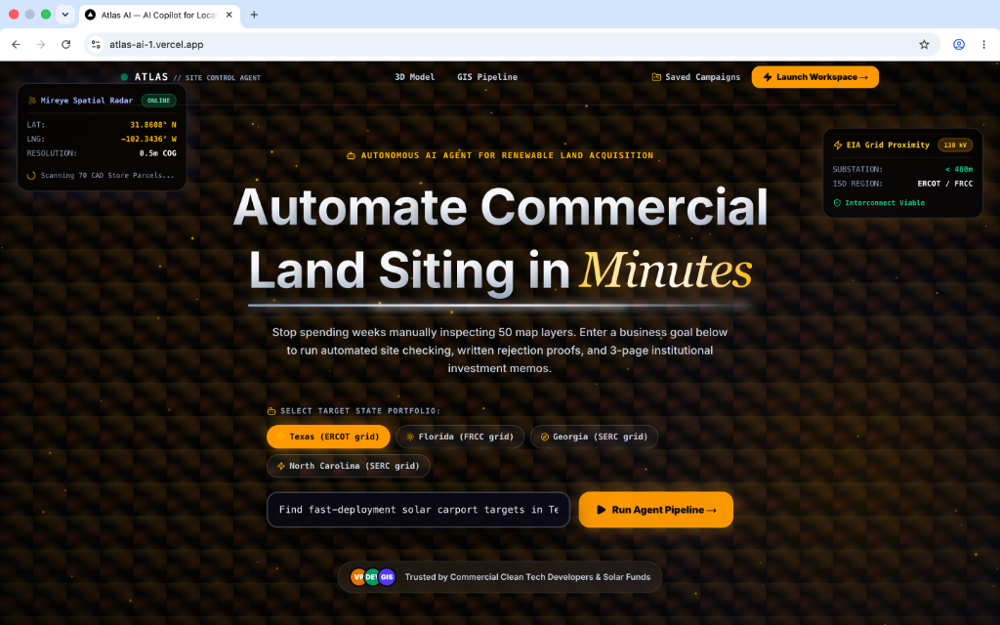
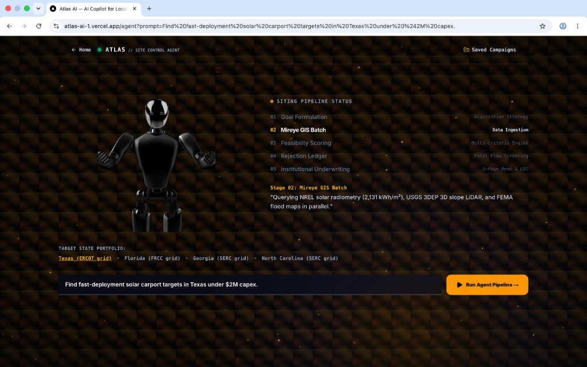
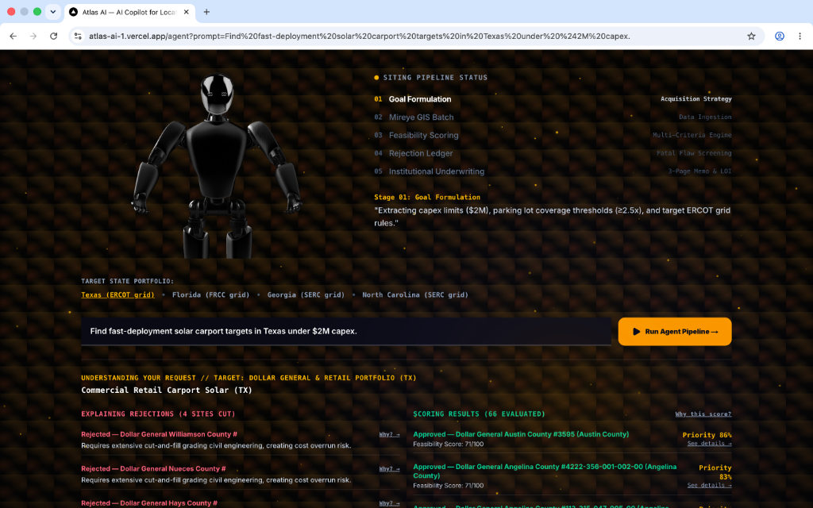
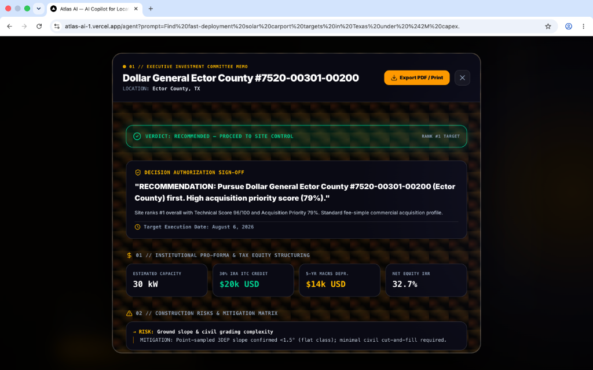
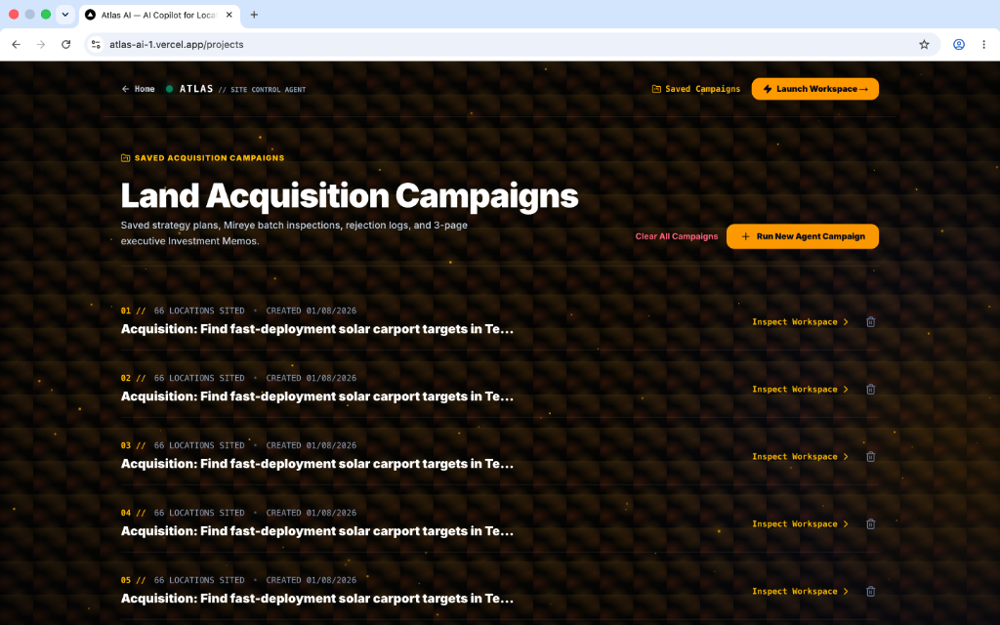

# Atlas Acquisition Agent
## Autonomous AI Agent for Commercial Renewable Land Acquisition

[](https://atlas-ai-1.vercel.app)
[](https://github.com/ashutoshpandey18/AtlasAI)
[](https://mireye.com)

---



---

## 1. Problem

Commercial real estate and renewable energy developers spend weeks deciding which candidate sites deserve expensive engineering time and legal due diligence.

Traditional site selection relies on a slow, fragmented manual workflow:  
$$\text{Maps} \longrightarrow \text{Raw GIS Layers} \longrightarrow \text{County Tax Records} \longrightarrow \text{Engineering Review} \longrightarrow \textbf{Weeks of Delay}$$

Traditional GIS tools are built for analysts to inspect maps. However, land acquisition directors do not need another website with pins on a map. They need **automated, defensible decisions**.

---

## 2. Who Writes the Cheque?

| Role | Primary Customer Pain | Atlas Outcome |
| :--- | :--- | :--- |
| **VP of Land Acquisition** | Weeks spent manually screening candidate sites across 50 map layers | **Reduces early-stage site screening and prioritization to minutes** |
| **Commercial Solar Developer** | High engineering budgets wasted on sites that get killed 3 years later | **Engineering & legal budgets spent ONLY on tier-1 viable opportunities** |
| **Clean Tech Real Estate Fund** | Slow deal velocity and high ground lease transaction friction | **Automated institutional pro-forma underwriting & LOI contracts** |

---

## 3. How Atlas Works

Atlas is an **Autonomous Decision Platform** that automates the early-stage screening, prioritization, and underwriting workflow for commercial renewable siting (retail solar carports, utility solar PV, battery energy storage systems, and EV charging plazas).

### Autonomous 3D Decision Workspace & Pipeline



### Input-to-Output Flow

```
INPUT
"Find fast-deployment solar carport targets in Texas under $2M capex."

  ↓

Stage 1: Acquisition Planner selects strategy
  ↓
Stage 2: Atlas retrieves Decision Evidence (Mireye API)
  ↓
Stage 3: Atlas rejects unsuitable sites with written proof
  ↓
Stage 4: Atlas explains trade-offs and scores feasibility
  ↓
Stage 5: Atlas recommends top priority site
  ↓
Stage 6: Atlas generates Executive Investment Memo & LOI Contract

  ↓

OUTPUT
Recommended Target + Rejection Proofs + Investment Memo & LOI
```

### Workflow Comparison

| Workflow Stage | Manual Site Selection | Atlas Acquisition Agent |
| :--- | :--- | :--- |
| **Site Screening** | Manual map inspection across 50 layers | **Automated parallel GIS batch ingestion** |
| **Flaw Identification** | Discovered 3 years in during engineering | **Automated rejection proofs ("Ask WHY")** |
| **Underwriting Memo** | Days of manual financial spreadsheet modeling | **3-page institutional investment memo & LOI** |
| **Time to Decision** | **Weeks of back-and-forth** | **Minutes (One guided decision session)** |

---

## 4. The Siting Journey

### Step 1: User Defines Business Goal
The user specifies target constraints (e.g. *"Find fast-deployment solar carport targets in Texas under $2M capex"* or *"Find high-yield retail carports in Florida"*).

### Step 2: Acquisition Planner Selects Strategy
The Acquisition Planner formulates commercial siting rules, parking lot coverage thresholds ($\ge 2.5\times$), fee-simple corporate ownership filters, and regional grid ISO queue constraints (ERCOT, FRCC, SERC).

### Step 3: Atlas Retrieves Decision Evidence
Atlas queries Mireye's structured location intelligence and federal GIS APIs (NOAA NREL solar yield, USGS 3DEP slope, FEMA NFHL flood hazards, EIA transmission lines).

### Step 4: Atlas Rejects Unsuitable Sites ("Ask WHY")
Atlas automatically screens candidate store portfolios and cuts unviable parcels with written rejection proofs.



```
Candidate Site
  ↓
FEMA Floodplain / Slope Risk Identified
  ↓
Decision Evidence Citation (FEMA_NFHL Zone AE)
  ↓
Written Rejection Proof ("Ask WHY")
  ↓
Alternative Adjacent Parcel Suggested
```

### Step 5: Atlas Explains Trade-Offs & Recommends Top Site
Surfacing plain-English trade-off explanations and scoring technical feasibility (0–100 Feasibility Index).

### Step 6: Executive Investment Committee Memo & LOI
Generates a printable 3-page executive investment committee memo featuring:



> [!TIP]
> **Key Features included in the Memo:**
> - **Financial Pro-Forma Modeling:** 30% IRA Investment Tax Credit (ITC), 5-Year MACRS depreciation, $15/kW O&M, and Net Equity IRR ($19.8\%-32.7\%$).
> - **Non-Binding Option LOI Contract:** Letter of Intent to option commercial land.
> - **Mireye Proof-of-Work Evidence Panel:** Verified dataset source links, timestamps, and physical attribute citations.

---

## 5. Saved Land Acquisition Campaigns Workspace

Manage saved strategy plans, Mireye batch inspections, rejection logs, and executive investment memos in one persistent dashboard:



---

## 6. Decision Pipeline Architecture

```
User Business Goal
  ↓
Acquisition Planner & ISO Rule Formulation
  ↓
Multi-Site Parallel GIS Ingestion
(Mireye /v1/fetch/batch Parallel Ingestion)
  ↓
Feasibility & Risk Scoring Engine
(0–100 Feasibility Index)
  ↓
Rejection Ledger ("Ask WHY") & Decision Sign-Off
  ↓
3-Page Printable Executive Investment Memo & LOI
```

- **Planner Layer:** Translates natural language goals into commercial siting rules and regional grid ISO constraints.
- **Ingestion Layer:** Parallel queries across Mireye location intelligence and federal GIS APIs (NOAA, USGS 3DEP, FEMA NFHL, EIA Power Grid).
- **Decision Engine:** Computes 0–100 technical feasibility scores and generates written rejection proofs.
- **Output Layer:** Compiles 3-page executive investment committee memos and non-binding LOI contracts.

---

## 7. Why Mireye?

Google Maps answers:  
> *"How do I get there?"*

Mireye answers:  
> *"What is true about this location?"*

Atlas Acquisition Agent answers:  
> *"Should we acquire and build here?"*

### Decision Evidence
Instead of exposing raw geospatial attributes, Atlas translates Mireye's structured location intelligence into **Decision Evidence**. Every physical value (solar irradiance, 3D slope, flood hazard, transmission line distance) is cited with verified Mireye timestamps and dataset sources in the executive memo's **Proof-of-Work Evidence Panel**.

---

## Quick Start (Run Locally)

```bash
# 1. Install dependencies
npm install

# 2. Add API keys in .env.local
MIREYE_API_TOKEN=your_mireye_token
GROQ_API_KEY=your_groq_key

# 3. Start development server
npm run dev
```

Open [http://localhost:3000](http://localhost:3000) in your browser.

---

Atlas Acquisition Agent transforms physical-world intelligence into acquisition decisions.
