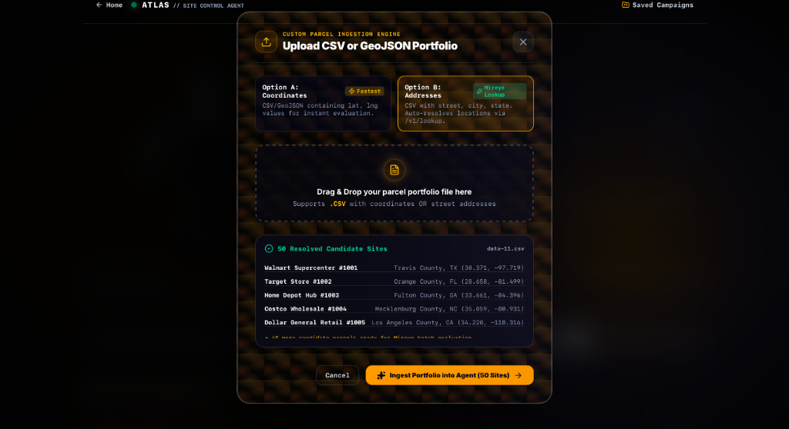

# Atlas AI

An autonomous land acquisition agent for commercial renewable energy development.

Atlas ingests candidate site portfolios, evaluates physical GIS constraints, disqualifies unviable parcels, and generates institutional investment memos with land option agreements.

---

## The Problem

Commercial solar and energy storage developers spend weeks screening candidate properties. Traditional site selection relies on manual map inspection across fragmented GIS layers, county tax records, and utility grid maps.

When a developer acquires land containing hidden steep terrain, floodways, or remote heavy-equipment transport access, transport and civil grading costs escalate by over $120,000 in specialized route escorts or earthwork overruns.

---

## The Solution

Atlas automates early-stage land screening and underwriting into a single execution workflow. It ingests parcel portfolios, queries physical GIS data from Mireye and public datasets, applies multi-criteria technical scoring, and produces defensible site control recommendations.

---

## Demo

- **Live Production**: [https://atlas-ai-pi-one.vercel.app](https://atlas-ai-pi-one.vercel.app)
- **Repository**: [https://github.com/ashutoshpandey18/AtlasAI](https://github.com/ashutoshpandey18/AtlasAI)


---

## Features

- Ingests parcel portfolios via CSV (street addresses or geographic coordinates)
- Resolves parcel geocodes and boundary locations via Mireye `/v1/lookup`
- Fetches physical solar radiometry, slope, and flood clearance via Mireye `/v1/fetch`
- Evaluates heavy equipment transport drive times via Mireye `/v1/proximity`
- Disqualifies unviable candidate parcels with written rejection proofs
- Ranks candidate parcels using multi-criteria technical feasibility scores (0-100)
- Answers due diligence queries via Spatial Copilot `/v1/ask`
- Generates 3-page executive investment committee memos with LOI option contracts

---

## How Atlas Works


```mermaid
graph TD
    A[Portfolio CSV Upload] --> B[Planner Strategy Formulation]
    B --> C[Mireye Geocoding /v1/lookup]
    C --> D[Mireye Physical Fetch /v1/fetch]
    D --> E[Mireye Proximity Routing /v1/proximity]
    E --> F[Multi-Criteria Technical Scoring]
    F --> G[Rejection Ledger & Disqualification]
    G --> H[Rank #1 Winner Parcel Selection]
    H --> I[Decision Ledger & Spatial Copilot /v1/ask]
    I --> J[3-Page Investment Memo & LOI Contract]
```

---

## Product Walkthrough

### 1. Portfolio Ingestion & Pipeline Status

Upload portfolio CSV files with street addresses or coordinates. Atlas processes candidate parcels in parallel while displaying real-time execution pipeline status.


---

### 2. Live Map Tiles & Reverse Geocode Inspector

Inspect parcel placement, coordinates, and reverse-geocoded address records on interactive vector OpenStreetMap tiles.


---

### 3. Winner Selection & Replayable Trace

Atlas identifies top candidates, ranks the #1 winning site, and logs a 10-stage millisecond audit trail for investment committee verification.



---

### 4. Decision Ledger & Spatial Copilot

Review why the winning parcel was selected over rejected alternatives, verify Mireye Proximity heavy transport clearance, and ask due diligence questions.


---

### 5. Investment Committee Memo & LOI Contract

Export a downloadable 3-page Executive Investment Committee Memo detailing technical feasibility scores, CapEx savings, IRA §48 tax credit bonuses, and land option agreements.


---

## Mireye Integration

| Endpoint | Purpose | Where Atlas Uses It |
| :--- | :--- | :--- |
| `POST /v1/lookup` | Resolves street addresses to lat/lng coordinates and county boundaries | Portfolio geocoding step (`/api/mireye/lookup`) |
| `POST /v1/fetch` | Extracts NREL POA solar yield, USGS 3DEP 1.2° slope, and FEMA flood clearance | Physical GIS evaluation (`src/services/mireyeApiClient.ts`) |
| `POST /v1/proximity` | Calculates heavy equipment transport drive times from Interstate freight corridors | Transport clearance scoring (`src/services/mireyeProximityService.ts`) |
| `POST /v1/ask` | Synthesizes natural language due diligence answers with comparative trade-off reasoning | Spatial Copilot interface (`/api/mireye/ask`) |

---

## External Data

- **NREL PVWatts v8**: Plane-of-Array (POA) solar irradiance (`kwh/m2/yr`) to project annual energy generation.
- **USGS 3DEP LiDAR**: Elevation data used to calculate ground slope and identify grading cost overruns.
- **FEMA NFHL**: Floodplain boundaries used to disqualify Zone AE floodways and verify Zone X clearance.
- **Texas CAD Tax Delinquency Rolls**: County Appraisal District records used to identify tax-delinquent properties for motivated seller scoring.
- **EIA Substation Data**: Electric Information Administration distribution grid dataset used to measure feeder distance to 138kV substations.

---

## API Testing

<details>
<summary>1. Physical GIS Layer Intelligence (POST /v1/fetch)</summary>

Fetches physical radiometry, slope, and flood risk for input coordinates.


```bash
curl -X POST https://atlas-ai-pi-one.vercel.app/api/mireye/fetch \
  -H "Content-Type: application/json" \
  -d '{"lat":39.9881,"lng":-83.0384,"fields":["poa_irradiance_optimal_tilt_kwh_m2_yr","slope_degrees","fema_flood_zone"]}'
```
</details>

<details>
<summary>2. Save Acquisition Campaign (POST /api/campaigns)</summary>

Persists evaluated acquisition campaigns to Turso SQLite storage.


```bash
curl -X POST https://atlas-ai-pi-one.vercel.app/api/campaigns \
  -H "Content-Type: application/json" \
  -d '{"id":"ashutoshAtlas","name":"Acquisition: Fast deployment solar in Texas under $2M capex","useCaseId":"solar-carport","requirements":{"targetState":"TX","capexLimitUsd":2000000},"locations":[]}'
```
</details>

<details>
<summary>3. Retrieve Saved Campaigns (GET /api/campaigns)</summary>

Retrieves saved acquisition campaign records for review.


```bash
curl -X GET https://atlas-ai-pi-one.vercel.app/api/campaigns
```
</details>

<details>
<summary>4. Spatial Copilot Q&A (POST /v1/ask)</summary>

Answers due diligence questions with comparative trade-off reasoning.


```bash
curl -X POST https://atlas-ai-pi-one.vercel.app/api/mireye/ask \
  -H "Content-Type: application/json" \
  -d '{"question":"Which site has the lowest construction and transport risk?","promptStr":"Find commercial solar targets in Ohio under $2M capex","evaluations":[{"siteName":"Kroger Supermarket","county":"Franklin County","state":"OH","techScore":94}],"rejections":[]}'
```
</details>

<details>
<summary>5. Streaming Site Scan Pipeline (POST /api/agent/site-scan)</summary>

Streams Server-Sent Events (SSE) during portfolio evaluations.


```bash
curl -X POST https://atlas-ai-pi-one.vercel.app/api/agent/site-scan \
  -H "Content-Type: application/json" \
  -H "Accept: text/event-stream" \
  -d '{"prompt":"Find commercial solar carports in Texas under $2M capex.","dataset":[{"geo_id":"US-TX-0001","chain":"Kroger Supermarket","address":"12600 Westheimer Rd","city":"Houston","state":"TX","zip":"77077","lat":29.7365,"lon":-95.6032}]}'
```
</details>

---

## Project Structure

```text
Atlas/
├── public/
│   ├── data/                 # Sample portfolio CSV datasets (15 to 500 sites)
│   └── images/               # Screenshots for documentation
├── src/
│   ├── agent/                # Multi-criteria decision engine & scoring logic
│   ├── app/                  # Next.js App Router pages and API routes
│   ├── components/           # UI components (DecisionLedger, SpatialCopilot, Memo)
│   ├── services/             # Mireye API clients and Turso DB persistence
│   └── types/                # TypeScript interface definitions
```

---

## Local Setup

```bash
git clone https://github.com/ashutoshpandey18/AtlasAI.git
cd AtlasAI
npm install
npm run dev
```

Open [http://localhost:3000](http://localhost:3000) in your browser.

---

## Design Decisions

- **Server-Sent Events (SSE)**: Selected over WebSockets to stream evaluation progress without managing persistent state.
- **Two-Tier Caching**: Combines in-memory RAM deduplication with Turso Edge SQLite to avoid duplicate credit consumption on re-scans.
- **Adaptive Chunk Pacing (`BATCH_SIZE = 15`)**: Paces parallel requests in chunks of 15 candidate parcels to comply with Mireye rate limits.
- **Exponential Backoff**: Automatically handles HTTP 429 `Retry-After` headers and retries with backoff delays.

---

## Challenges

- **Rate Limit Management**: Ingesting 500 candidate parcels simultaneously risks hitting rate limits. Resolved by implementing adaptive chunk pacing with 350ms delays between batches.
- **Serverless Timeouts**: Long-running scans can trigger Vercel 15-second execution timeouts. Resolved by using Server-Sent Events to flush headers immediately at 0ms.
- **Cross-State Tax Delinquency Normalization**: Normalizing property tax records across different Texas County Appraisal Districts required building a mapping dictionary in `intelligence.ts`.

---

## Future Work

- Substation capacity queue integration with CAISO, ERCOT, and PJM.
- Automated title search parsing from county deed records.
- Polygon editing tools for interactive parcel boundary adjustments.

---

## Credits

- **Mireye Platform**: Location intelligence APIs (`/v1/lookup`, `/v1/fetch`, `/v1/ask`, `/v1/proximity`).
- **NREL**: PVWatts v8 solar radiometry dataset.
- **USGS**: 3DEP 3D elevation LiDAR program.
- **FEMA**: National Flood Hazard Layer (NFHL).
- **Next.js & React**: Core web framework.
- **Turso & libSQL**: Edge SQLite database layer.
